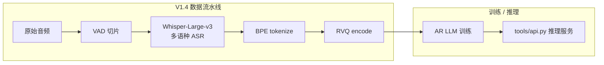

## 前置知识

> [!important]
> 
> 阅读本页前建议先读：[[1.1 Fish-Speech V1.2]]。V1.4 是 V1.2 的**数据与脚本迭代**，架构层面只有微小调整。

---

## 1.2.0 定位

> 一句话：V1.4 是 Fish-Speech 第 1 代的**最终形态**——把训练数据扩到 ~70 k 小时、把多语种从 2 个加到 8 个、把推理脚本工程化为可服务化的 `tools/api.py`，但**架构仍是单 AR + RVQ**，是 V1.5 大改前的最后一个版本。

---

## 1.2.1 关键差异（V1.2 → V1.4）

|维度|V1.2|V1.4|
|---|---|---|
|训练数据|~20 k 小时|**~70 k 小时**|
|支持语言|中、英|**中、英、日、韩、德、法、西、阿** 8 种|
|LLM 参数|~500 M|~700 M（扩深）|
|RVQ 层数|8|8（未变）|
|Token rate|75 Hz|75 Hz（未变）|
|推理 API|仅脚本|`**tools/api.py**` **HTTP 服务**|
|WebUI|无|Gradio 内置|

---

## 1.2.2 工程视角

---

## 1.2.3 V1.4 暴露出的瓶颈

虽然数据扩了 3.5×，但有些问题不是「加数据」能解的：

1. **首包延迟没变**：仍是 75 Hz × 8 层，TTFB 在 4090 上仍 ~700 ms。

1. **长文本节奏抖动**：单 AR 直接预测 RVQ token，没有显式的「韵律 / 节奏」中间表示。

1. **小语种质量塌方**：8 种语言数据极不均衡（中英占 70%+），日韩德质量明显次于中英。

这三点把团队推向了 V1.5 的 **Dual-AR 重构**。

---

## 1.2.4 工程判断

> [!important]
> 
> V1.4 的实用价值在于`**tools/api.py**` 服务化脚本——很多生产部署即使用 S1 权重，也复用了 V1.4 时代沉淀下来的 API 框架。架构本身已被 S1 全面取代。

---

## 延伸阅读

- [[1.3 Fish-Speech V1.5 - V1.5.1]]：架构换代。

- [[6.1 多语种数据分布]]：数据扩量细节。

---

## 参考文献

1. Fish Audio. _Fish-Speech V1.4 Release Notes_, 2024-08.

1. Fish-Speech 仓库 tag `v1.4`，`tools/api.py`、`tools/webui.py`。

1. Radford et al. _Robust Speech Recognition via Large-Scale Weak Supervision (Whisper)_, ICML 2023.