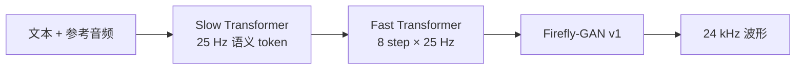

## 前置知识

> [!important]
> 
> 阅读本页前建议先读：[[2. 核心架构：Dual-AR（双自回归）]]、[[3. 语音 Tokenizer：GFSQ]]。V1.5 是它们诞生的版本。

---

## 1.3.0 定位

> 一句话：V1.5 是 Fish-Speech 系列**第一个真正用 Dual-AR + GFSQ 跑通**的版本，把首包延迟从 700 ms 砍到 ~200 ms，并把支持语言扩到 13 种。V1.5.1 是 V1.5 的小幅修复版本（VAD 切片、长文本稳定性）。**V1.5 之后系列改名 OpenAudio S1**。

---

## 1.3.1 关键差异（V1.4 → V1.5）

|维度|V1.4|V1.5|
|---|---|---|
|架构|单 AR + RVQ|**Dual-AR**（Slow + Fast）|
|Tokenizer|RVQ 75 Hz × 8|**GFSQ 25 Hz × 8（FSQ × GVQ）**|
|声码器|VQ-GAN 内置|**Firefly-GAN v1（独立模块）**|
|支持语言|8|**13**（增日、韩、阿、葡、波、荷、意）|
|TTFB（4090）|~700 ms|**~200 ms**|
|Codebook 利用率|~70%（RVQ）|**100%（FSQ 性质）**|

---

## 1.3.2 三项关键决策

### 决策 1：Tokenizer 从 RVQ 换 GFSQ

RVQ 训练需要 EMA、commitment loss、codebook restart 三件套且利用率封顶 ~80%。**FSQ 用「四舍五入到固定网格点」替代「学一个 codebook」**，自动 100% 利用率（详见 [[3.1 FSQ 原理]]）。GVQ 把单个 FSQ 不够的容量按维度切块扩展（[[3.2 GVQ（Grouped Vector Quantization）]]）。

### 决策 2：单 AR 拆成 Dual-AR

单 AR 在 75 Hz 下需要 600 步/s 前向。V1.5 把语义层降到 25 Hz（Slow），把声学细节交给 Fast 的 8 步小循环。Slow 大、Fast 小，**总参数没有显著上升，但有效 token 频率降低 3×**，TTFB 直接砍 3 倍。详见 [[2. 核心架构：Dual-AR（双自回归）]]。

### 决策 3：Vocoder 独立为 Firefly-GAN

之前 VQ-GAN 把 codec 与声码器耦合在一起，改一个就要重训另一个。V1.5 把声码器单独拆为 **Firefly-GAN**（详见 [[4. 声码器：Firefly-GAN（FFGAN）]]），可独立迭代。

---

## 1.3.3 V1.5 → V1.5.1 修了什么

> [!important]
> 
> V1.5 首发后社区反馈：
> 
> 1. **句首爆音**：VAD 切片不干净导致输入端含静音 token，Fast 段错估时长。V1.5.1 把 VAD 阈值收紧 + 在 dataloader 端加 trim_silence。
> 
> 1. **长文本（>30 s）速率漂移**：Slow 的 RoPE base 在长序列外推时旋转失真。V1.5.1 把 RoPE base 从 10000 改为 500000。
> 
> 1. **多说话人混音**：参考音频质量不一时，Slow 的 prompt prefix 容易被噪声主导。V1.5.1 在 dataloader 加 SNR 过滤。

---

## 1.3.4 工程判断

> [!important]
> 
> **V1.5 / V1.5.1 vs S1**：架构层面相同，S1 是 V1.5 的**重训权重 + 工程化包装**版本。新项目直接用 S1，不要再选 V1.5——HuggingFace 上 S1 权重质量更高、license 表述更清晰。

---

## 延伸阅读

- [[1.4 OpenAudio S1]]：V1.5 工程化收敛后的版本。

- [[2.4 KV-Cache 与首包延迟]]：TTFB 优化的另一根支柱。

---

## 参考文献

1. Fish Audio. _Fish-Speech V1.5 Technical Report_, 2024-12.

1. Fish-Speech 仓库 tag `v1.5`、`v1.5.1`，`fish_speech/models/text2semantic/llama.py`、`fast.py`。

1. Mentzer et al. _Finite Scalar Quantization: VQ-VAE Made Simple_. arXiv:2309.15505, 2023.