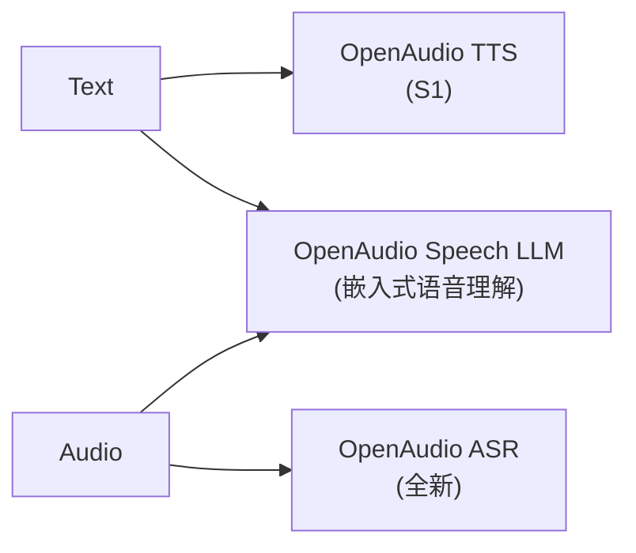

## 前置知识

> [!important]
> 
> 阅读本页前建议先读：[[1.3 Fish-Speech V1.5 - V1.5.1]]、[[1.7 许可证演进（CC-BY-NC-SA 4.0）]]。

---

## 1.4.0 定位

> 一句话：**OpenAudio S1** 是 Fish Audio 在 2025 年发布的首个名为「OpenAudio」的版本，对外不再使用「Fish-Speech」品牌名，走向产品化与商业许可。

---

## 1.4.1 为什么改名 OpenAudio

> [!important]
> 
> 三个改名动机：
> 
> 1. **产品拓展**：Fish Audio 不再局限于 TTS，还进入 STT/ASR。OpenAudio = TTS + ASR + Speech LLM 三位一体。
> 
> 1. **许可调整**：S1 对个人免费，但商用需许可费。
> 
> 1. **品牌严肃化**：面向企业客户，Fish-Speech 过于「社区项目」。

---

## 1.4.2 架构变动

|组件|V1.5|**S1**|变化点|
|---|---|---|---|
|Backbone|Llama 0.5B|**Qwen2.5 0.5B / 1.5B**|更好中文、中英双语|
|Tokenizer|GFSQ 21Hz|GFSQ 21Hz|保持|
|Vocoder|FFGAN v1|**FFGAN v2**（训练优化）|EMA + R1|
|训练数据|~10 k h|**~50 k h**|量级跳升|
|语种|EN/ZH/JA/KR|**• FR/DE/ES/IT**|8 语种|

---

## 1.4.3 OpenAudio S1 的三件套

---

## 1.4.4 设计哲学上的变化

1. **体验优先于论文 SOTA**：S1 调优了起始推理延迟、prompt audio 仅需 3–5 秒（V1.5 需 10–15 秒）。

1. **插件化 vocoder 取消**：FFGAN 不再允许交换，只随 S1 一起发布。

1. **企业级部署**：ONNX/TensorRT 导出脚本随同仓库提供。

---

## 1.4.5 与 Fish-Speech 名称重叠问题

> [!important]
> 
> 社区上 S1 仍被称为「Fish-Speech S1」，但官方名为 OpenAudio S1。仓库在 GitHub fishaudio/fish-speech 中同时提供 S1 与 S2/S2-Pro，使用 S 系列权重时应遵守 OpenAudio 的许可证。

---

## 1.4.6 对后续版本的影响

S1 为后续 S2/S2-Pro 奠定了：

- Backbone 路线走 Qwen 系列。

- Vocoder 锁定 Firefly-GAN。

- Tokenizer 不再调整 group/codebook size。

---

## 延伸阅读

- [[1.5 Fish Audio S2]]

- [[1.7 许可证演进（CC-BY-NC-SA 4.0）]]

---

## 参考文献

1. Fish Audio. _OpenAudio S1 Release Notes_, 2025.

1. fishaudio/fish-speech GitHub Repository.