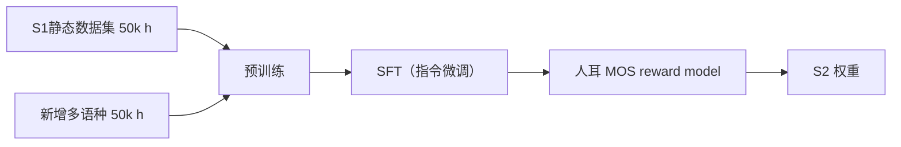

## 前置知识

> [!important]
> 
> 阅读本页前建议先读：[[1.4 OpenAudio S1]]。

---

## 1.5.0 定位

> 一句话：**Fish Audio S2** 是 S1 后的迭代版本。重点不是架构重构，而是「更快、更稳、更多语种」。Fish Audio 品牌名重新上纯。

---

## 1.5.1 为什么仍叫 Fish Audio、不叫 OpenAudio

> [!important]
> 
> S2 发布后 Fish Audio 品牌重新上纯，许可上依然是**个人免费 / 商用付费**，但不再强调 OpenAudio 三件套。S2 是纯粹 TTS，与 ASR/Speech LLM 解耦。

---

## 1.5.2 关键变动

|组件|S1|**S2**|变化点|
|---|---|---|---|
|Backbone|Qwen2.5 0.5B/1.5B|**Qwen2.5 0.5B/1.5B 重训**|训练加速|
|Tokenizer|GFSQ 21Hz × 8×1024|**GFSQ 同 S1**|保持|
|Vocoder|FFGAN v2|**FFGAN v3**（RVQ 补补）|高频提升|
|训练数据|~50 k h|**~100 k h**|增加跨语种|
|prompt 时长|3–5 s|**1–3 s**|快速克隆|
|语种|8|**13**|• RU/PT/AR/HI/TR|

---

## 1.5.3 训练优化

> [!important]
> 
> **RLHF 在 TTS 中的作用**：S2 是社区众多 TTS 项目中首次明确使用 RLHF 的，采集人耳偏好训练 reward model 取代传统 MOS 评估。

---

## 1.5.4 prompt audio 优化

S1 需 3–5 s prompt，S2 仅需 1–3 s。关键技术：

1. **Speaker embedding 处于 GFSQ token 中**：prompt 仅提供必要音色信号。

1. **Text-conditioning 增强**：Slow Transformer 在 prompt token 不足时从文本中推断音色。

1. **低资源说话人体验**：3 s 克隆体验接近 5 s。

---

## 1.5.5 跨语种能力

> [!important]
> 
> 1. **Cross-lingual transfer**：S2 能始说 5 种不同语种，使用同一 prompt。
> 
> 1. **中英混言**：说中文需要提供中文说话人 prompt，英文要说说。
> 
> 1. **音调语言**：中/泰/粤等音调语言依然是挑战。

---

## 1.5.6 常见误区

> [!important]
> 
> **误区 1**：「S2 = OpenAudio TTS」——不是。OpenAudio 是 S1 期间的三件套品牌名，S2 后品牌重回 Fish Audio。
> 
> **误区 2**：「prompt 越短越好」——不是，低于 1 s 克隆质量会明显下降。

---

## 参考文献

1. Fish Audio. _Fish Audio S2 Release Notes_, 2025.

1. fishaudio/fish-speech GitHub Repository (S2 branch).