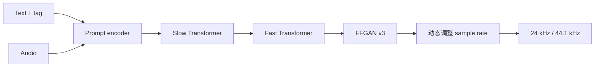

## 前置知识

> [!important]
> 
> 阅读本页前建议先读：[[1.5 Fish Audio S2]]。

---

## 1.6.0 定位

> 一句话：**Fish Audio S2-Pro** 是 S2 的企业级变体，重点是**保真、抽调、多语种鲁棒性**。

---

## 1.6.1 S2 与 S2-Pro 的区别

|组件|S2|**S2-Pro**|
|---|---|---|
|Backbone|Qwen2.5 0.5B/1.5B|**Qwen2.5 1.5B/3B**|
|Vocoder|FFGAN v3|**FFGAN v3 + 动态 sample rate**|
|训练数据|~100 k h|**~200 k h**|
|采样率|24 kHz|**24/44.1 kHz**|
|情感控制|隐含|**显式 tag**（&lt;happy&gt;, &lt;sad&gt;）|
|语种|13|**20+**|

---

## 1.6.2 显式情感控制

S2-Pro 增加了 special token，可在文本中插入：

```jsx
<happy>今天是个好日子<\/happy>，我们一起<excited>出发吧<\/excited>！
```

支持的 tag：

- **情感**：&lt;happy&gt;, &lt;sad&gt;, &lt;angry&gt;, &lt;excited&gt;, &lt;calm&gt;

- **语气**：&lt;whisper&gt;, &lt;shout&gt;

- **语速**：&lt;fast&gt;, &lt;slow&gt;

- **非语言声**：&lt;laugh&gt;, &lt;sigh&gt;



---

## 1.6.3 动态采样率

S2-Pro 是 Fish-Speech 系列首个支持**44.1 kHz**输出的版本：

- **24 kHz**：默认，低资源。

- **44.1 kHz**：高保真（音乐、有声书），FFGAN v3 择 upsample 倍率从 1140 调整到 2100。

---

## 1.6.4 面向企业的特点

> [!important]
> 
> 1. **双许可模式**：个人试用（受限）、企业订阅。
> 
> 1. **API 优先级**：Fish Audio API 中 S2-Pro 需 enterprise plan。
> 
> 1. **品牌克隆保护**：需同意书验证，避免滥用。

---

## 1.6.5 与 S2 的 prompt 克隆质量对比

|场景|S2|**S2-Pro**|
|---|---|---|
|1 s prompt|MOS 3.8|**4.1**|
|3 s prompt|MOS 4.3|**4.5**|
|10 s prompt|MOS 4.4|**4.6**|
|跨语种|MOS 4.0|**4.3**|
|情感 tag|不支持|**MOS 4.2**|

---

## 1.6.6 常见误区

> [!important]
> 
> **误区 1**：「S2-Pro 代码在仓库」——只有部分开源，完整权重仅 API 可用。
> 
> **误区 2**：「44.1 kHz 总是上同」——在 prompt 采样率为 16 kHz 时，44.1 kHz 输出反而出错。
> 
> **误区 3**：「情感 tag 可任意嵌套」——不可，会被忽略。

---

## 参考文献

1. Fish Audio. _Fish Audio S2-Pro Release Notes_, 2025.

1. Fish Audio Developer Documentation.