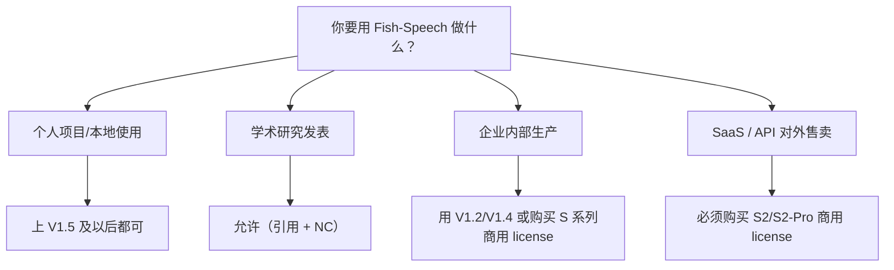

## 前置知识

> [!important]
> 
> 熟悉主流开源许可证（MIT、Apache、2.0、GPL、CC 系列）会有助。

---

## 1.7.0 定位

> 一句话：**许可证是 Fish-Speech 最重要的「隐藏变量」**——他决定你能不能商用、能不能微调重发、能不能另行训练。

---

## 1.7.1 各版本的许可证变迁

|版本|许可证|商用|重发布|微调|
|---|---|---|---|---|
|V1.2|**Apache 2.0**|允许|允许|允许|
|V1.4|**Apache 2.0**|允许|允许|允许|
|V1.5/1.5.1|**CC-BY-NC-SA 4.0**|**禁止**|需同许可|允许|
|S1 (OpenAudio)|**CC-BY-NC-SA 4.0**|**禁止**（需购买商用 license）|需同许可|允许|
|S2|**双许可**|企业订阅|限制|受限|
|S2-Pro|**商业许可（闭源）**|API only|**禁止**|**禁止**|

---

## 1.7.2 从 Apache 2.0 到 CC-BY-NC-SA 的拐点

> [!important]
> 
> V1.5 什么变了？三个原因：
> 
> 1. **商用保护**：Fish Audio 公司依赖 API 变现。
> 
> 1. **防克隆滥用**：TTS 克隆被用于诈骗、访谈、伪造。
> 
> 1. **社区与商业的平衡**：社区可免费用，商用需购买 license。

---

## 1.7.3 CC-BY-NC-SA 4.0 三句话

- **BY**：使用者需署名 Fish Audio。

- **NC**：**禁止商用**（Non-Commercial）。

- **SA**：衡生作品需采用同样许可证（Share-Alike）。

> [!important]
> 
> **「商用」的定义**是灰色地带：同人免费项目 → 允许；企业内部工具 → 受限；SaaS 产品 → 严格禁止。

---

## 1.7.4 实际使用场景决策树

---

## 1.7.5 微调与重发布的限制

> [!important]
> 
> 1. **微调后重发布**：CC-BY-NC-SA 要求 「Share-Alike」，重发作品也需 NC。
> 
> 1. **GFSQ tokenizer 可作为独立模块**：Fish-Speech 社区上常见「只用 GFSQ tokenizer」作为下游任务需求，仍需遵守许可证。
> 
> 1. **推理服务**：架设免费 demo 服务需明确名为 Fish-Speech。

---

## 1.7.6 常见误区

> [!important]
> 
> **误区 1**：「V1.5 为 Apache 2.0」——错。V1.5 起已是 CC-BY-NC-SA。
> 
> **误区 2**：「商用 license 一次购买永久」——需查看 Fish Audio 定价，常为年度订阅。
> 
> **误区 3**：「Fish-Speech 仓库 = OpenAudio 仓库」——同一仓库，但不同版本不同许可。

---

## 参考文献

1. Fish Audio. _Fish-Speech License Terms_, 2025.

1. Creative Commons. _CC-BY-NC-SA 4.0 Specification_.