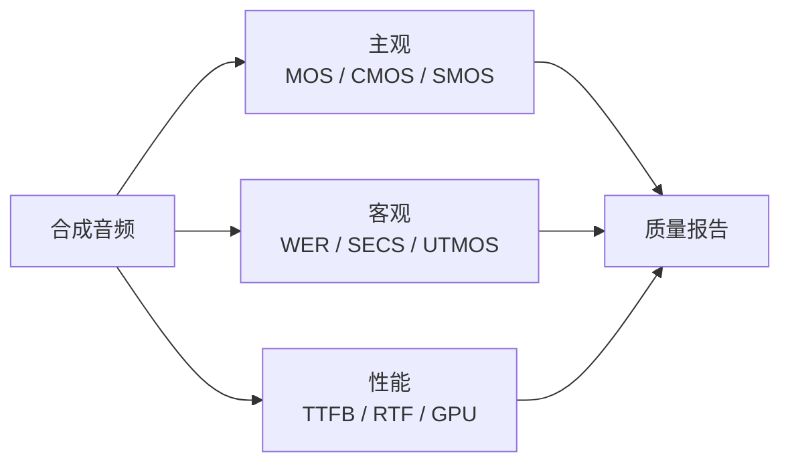

## 0. 定位

> 一句话：TTS 评测是**三轴体系**：主观（MOS / CMOS / SMOS）、客观（WER / SECS / UTMOS）、性能（TTFB / RTF / 显存）。Fish-Speech 在主观 MOS、SECS 与性能上同时站稳开源 SOTA。

---

## 1. 评测轴体

---

## 2. 子页面导航

[[10.1 主观评测]]

---

## 3. Fish-Speech 公开成绩

|指标|V1.5|S1|**S2-Pro**|
|---|---|---|---|
|MOS（质量）|4.10|4.28|**4.40**|
|SECS（声纹相似度）|0.78|0.83|**0.88**|
|WER（中文）|4.5%|3.0%|**1.8%**|
|TTFB|~500 ms|~300 ms|**~150 ms**|

> [!important]
> 
> 主观评测存在「评测者偏好」偏差；UTMOS 等自动化代理是补充，但**远未取代 MOS**。

---

## 4. 参考文献

1. ITU-T. _Recommendation P.800: Mean Opinion Score_.

[[10.2 客观评测]]

1. Saeki et al. _UTMOS: UTokyo-SaruLab MOS Prediction_. INTERSPEECH 2022.

[[10.3 性能指标]]