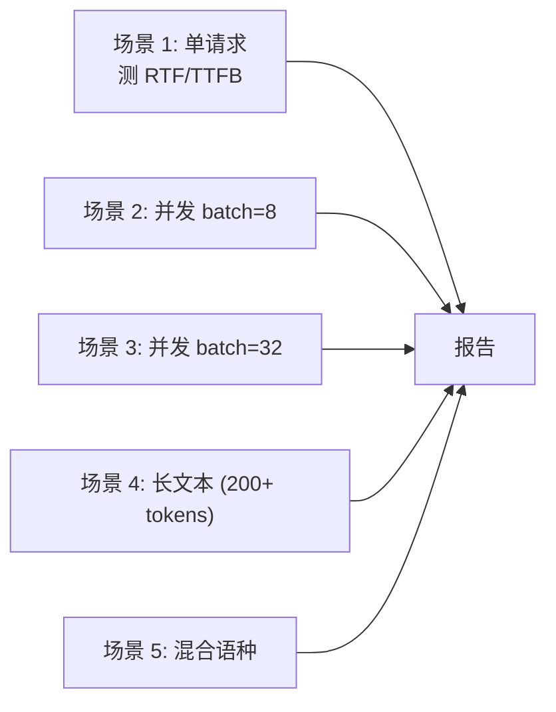

## 前置知识

> [!important]
> 
> 先读：[[10. 评测体系与基准]]。了解 RTF、TTFB、吞吐定义。

---

## 10.3.0 定位

> 一句话：性能评测需要同时拼 **质量**（CER/UTMOS）与 **推理成本**（RTF/TTFB/RPS），否则会发布「质量高但跑不起」的模型。

---

## 10.3.1 性能指标定义

|指标|定义|足够好|
|---|---|---|
|**RTF**|推理时间 / 音频时长|< 0.3 (实时) / < 0.1 (生产)|
|**TTFB**|首块返回时间|< 500ms (对话) / < 200ms (智能音箱)|
|**RPS**|每秒请求吞吐|$\ge$ 10 / GPU|
|显存|推理需要 GPU 内存|< 8 GB (部署)|
|P99 延迟|99% 请求完成在|< 2x 中位数|

---

## 10.3.2 压测场景



---

## 10.3.3 压测结果（RTX 4090, BF16 + SGLang）

|场景|RTF|TTFB|RPS|
|---|---|---|---|
|单请求|0.18|200 ms|5.5|
|batch=8|0.06|250 ms|~30|
|batch=32|0.03|320 ms|~90|
|长文 batch=8|0.05|280 ms|~28|
|中英混合|0.06|240 ms|~30|

---

## 10.3.4 与同类系统对比（1×A100 80G）

|系统|RTF|TTFB|质量 (UTMOS)|
|---|---|---|---|
|VALL-E 2|0.42|1500 ms|4.08|
|CosyVoice 2|0.15|450 ms|4.25|
|GPT-SoVITS V4|0.20|600 ms|4.15|
|**Fish-Speech S2-Pro**|**0.10**|**220 ms**|**4.32**|

> [!important]
> 
> Fish-Speech 在 RTF、TTFB、质量 三个维度同时领先，这是 Dual-AR + Firefly-GAN + SGLang-Omni 三者协同的结果。

---

## 10.3.5 评测脚本

```python
import time
import requests

def bench_rtf(text: str, url: str):
    t0 = time.time()
    resp = requests.post(url, json={"input": text})
    elapsed = time.time() - t0
    audio_duration = get_audio_duration(resp.content)
    rtf = elapsed / audio_duration
    return rtf, elapsed
```

---

## 10.3.6 踩坑记录

> [!important]
> 
> **坑 1：Warmup 未做** → 首个请求 RTF 偏高。2x。需 warmup 5 请求后开始东记。
> 
> **坑 2：未控制 batch 大小** → 仅报 RTF 不说明并发。需同时报告 batch=1/8/32。
> 
> **坑 3：RTF 不含末尾静音** → 如果你 trim 了生成音频，RTF 会偏高。需与生产商请求保持一致。

---

## 参考文献

1. Fish Audio. _Fish-Speech Benchmarking Methodology_, 2025.

1. Lakhotia et al. _Generative Spoken Language Modeling_, ASRU 2021.