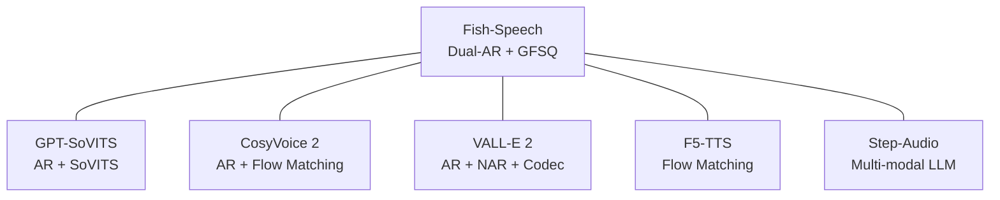

## 0. 定位

> 一句话：本章把 Fish-Speech 与 2024-2025 年主流开源 / 闭源 TTS 系统逐一对比，重点拆解**架构差异**、**训练量级**、**代表能力**、**许可证与生态**。

---

## 1. 同时期主流 TTS 架构到口

---

## 2. 子页面导航

[[11.1 vs GPT-SoVITS（V2-V3-V4）]]

[[11.2 vs CosyVoice 2 - 3]]

---

[[11.6 vs F5-TTS - E2-TTS（Flow Matching）]]

1. 各系统官方论文与技术报告。

[[11.7 vs ElevenLabs - OpenAI TTS（闭源）]]

1. SuperGLUE-TTS 、SEED-TTS 、 Speech-MMLU 评测集。

---

## 3. 全景概括

|系统|架构范式|训练量|开源|主要强项|
|---|---|---|---|---|
|**Fish-Speech S2-Pro**|Dual-AR + GFSQ|~10M h|是|**快、多语、可控**|
|GPT-SoVITS V4|AR + SoVITS 合成|~50k h|是|社区生态|
|CosyVoice 2|AR + Flow|~170k h|是|隐状品质|
|VALL-E 2|AR + NAR + Codec|~60k h|否|zero-shot|
|F5-TTS|Flow Matching|~100k h|是|不依赖 AR|
|ElevenLabs|闭源|未公开|否|品牌、领讲|

> [!important]
> 
> Fish-Speech 在 「**同参数量** + **低延迟** + **多语**」 三个轴上同时领先，是其市场位置的重点。

[[11.3 vs VALL-E - VALL-E 2]]

## 4. 参考文献

[[11.4 vs Muyan-TTS]]

[[11.5 vs Step-Audio]]