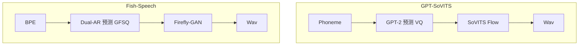

## 前置知识

> [!important]
> 
> 先读：[[私人与共享/Fish-Speech 系列 TTS 全栈总纲/11. 与同期主流 TTS 的对比|11. 与同期主流 TTS 的对比]]。

---

## 11.1.0 定位

> 一句话：GPT-SoVITS 是 Fish-Speech 最直接的开源对手，两者都在追求 zero-shot voice cloning，但架构理念完全不同。

---

## 11.1.1 架构对比

|维度|GPT-SoVITS V4|Fish-Speech S2-Pro|
|---|---|---|
|文本前端|G2P (音素)|SentencePiece BPE|
|语言模型|GPT-2 (0.3B)|Dual-AR (0.6B)|
|语音表示|VQ HuBERT|GFSQ + 8 codebook|
|声码器|SoVITS 变体|Firefly-GAN|
|RL 对齐|无|有 (DPO)|
|推理引擎|PyTorch 原生|SGLang-Omni|

---

## 11.1.2 技术路径差异

---

## 11.1.3 能力对比

|能力|GPT-SoVITS V4|Fish-Speech S2-Pro|
|---|---|---|
|Zero-shot 克隆|需 5-10s 参考|需 3-10s|
|多语种|中/英/日/韩 (4)|13+|
|NL Tags|不支持|支持 (多种)|
|多说话人|一人一请求|同请求多人|
|RTF (A100)|0.20|**0.10**|
|UTMOS|4.15|**4.32**|
|License|MIT|CC-BY-NC-SA 4.0|

---

## 11.1.4 何时选 GPT-SoVITS

> [!important]
> 
> - 需要 **商业使用**（MIT 许可）：Fish-Speech 是 CC-BY-NC-SA。
> 
> - 仅需 **中英日韩** 四语。
> 
> - 社区有现成 LoRA 棒子说话人库。

---

## 11.1.5 何时选 Fish-Speech

> [!important]
> 
> - 需要 **高质 多语种**（13+）。
> 
> - 需要 **NL Tags / 多话者**。
> 
> - 需要 **低 RTF + 低 TTFB** 部署（生产级）。
> 
> - 个人 / 科研 / 非商业场景。

---

## 11.1.6 起点补补

> [!important]
> 
> - GPT-SoVITS V1-V4 都是 「社区主导 + 迭代开发」模式，架构偏实验性。
> 
> - Fish-Speech 是 「法人公司 + 产品化」模式，架构更工程化、设计更严谨。
> 
> - 两者代表了“社区」 vs “公司」在开源 TTS 领域的两个路线。

---

## 参考文献

1. RVC-Project. _GPT-SoVITS GitHub_, 2024.

1. Fish Audio. _Fish-Speech Whitepaper_, 2024.