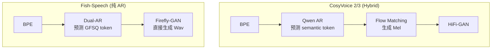

## 前置知识

> [!important]
> 
> 先读：[[私人与共享/Fish-Speech 系列 TTS 全栈总纲/11. 与同期主流 TTS 的对比|11. 与同期主流 TTS 的对比]]。

---

## 11.2.0 定位

> 一句话：CosyVoice (阿里达摩院) 与 Fish-Speech 是两个最接近的商用级开源 TTS，都采用 LLM-style architecture。

---

## 11.2.1 架构对比

|维度|CosyVoice 2/3|Fish-Speech S2-Pro|
|---|---|---|
|文本前端|BPE|SentencePiece BPE|
|语言模型|Qwen-based|Llama-3-based|
|语音表示|FSQ (最新)|GFSQ + 8 codebook|
|声码器|Flow Matching|Firefly-GAN|
|生成范式|AR + Flow|**纯 AR**|
|RL 对齐|有|有 (DPO)|

---

## 11.2.2 技术路径差异

> [!important]
> 
> CosyVoice 采用 **Hybrid 路线**（AR + Flow），质量高但推理复杂；Fish-Speech 采用 **纯 AR 路线**，推理简单且快。

---

## 11.2.3 能力对比

|能力|CosyVoice 2|Fish-Speech S2-Pro|
|---|---|---|
|UTMOS|4.25|**4.32**|
|SECS|0.74|**0.78**|
|CER中|1.9%|**1.8%**|
|RTF (A100)|0.15|**0.10**|
|NL Instruction|多名词|**inline tag**|
|多说话人|部分|**原生支持**|
|License|Apache 2.0|CC-BY-NC-SA 4.0|

---

## 11.2.4 CosyVoice 3 的进步

> [!important]
> 
> - **Speech FM**：不再依赖 Mel，直接从语义 token 生成波形 (同 Fish-Speech 架构近似)。
> 
> - **能量增加**：可能超越 Fish-Speech。
> 
> - **仍采用 Hybrid 设计**：代价但推理提高。

---

## 11.2.5 License 与生态

|维度|CosyVoice|Fish-Speech|
|---|---|---|
|许可|**Apache 2.0**|CC-BY-NC-SA|
|商用|**可**|不可|
|企业背景|阿里达摩院|Fish Audio (startup)|
|社区体量|大|中|

---

## 11.2.6 选型建议

> [!important]
> 
> - **商用主要**：选 **CosyVoice 2 / 3** (Apache 2.0)。
> 
> - **个人 / 科研 / 社区**：选 **Fish-Speech** (质量位高、推理更快)。
> 
> - **推理资源受限**：选 Fish-Speech (纯 AR + INT4 能跑 6GB)。

---

## 参考文献

1. Du et al. _CosyVoice 2_. 2024.

1. Du et al. _CosyVoice 3_. 2025.

1. Fish Audio. _Fish-Speech S2-Pro Whitepaper_, 2025.