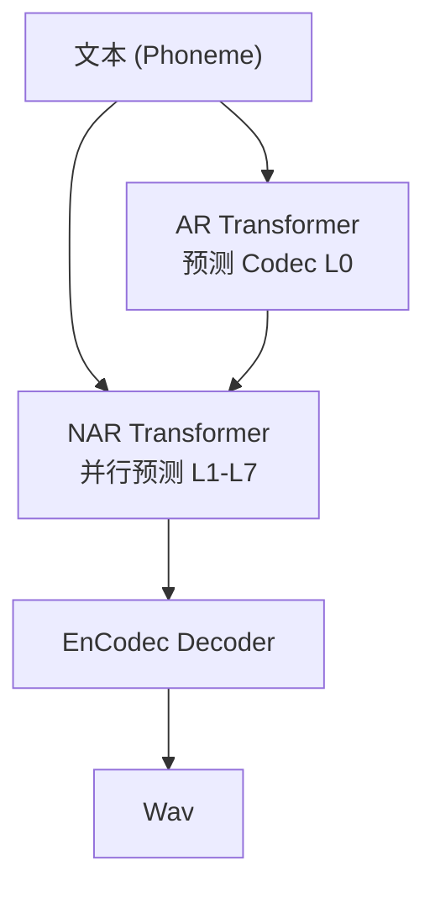

## 前置知识

> [!important]
> 
> 先读：[[私人与共享/Fish-Speech 系列 TTS 全栈总纲/11. 与同期主流 TTS 的对比|11. 与同期主流 TTS 的对比]]。

---

## 11.3.0 定位

> 一句话：VALL-E （微软 2023）是 LLM-style TTS 的开山作，提出了 「TTS = 语音 Token 的语言模型」这个范式，Fish-Speech 是这个范式的受益者。

---

## 11.3.1 VALL-E 架构

---

## 11.3.2 VALL-E 2 的改进

|VALL-E 1 (2023)|VALL-E 2 (2024)|
|---|---|
|EnCodec (8 codebook)|分层 RVQ + grouped|
|AR+NAR|合一为单 AR|
|质量 一般|质量提升|
|RTF 0.5+|RTF 0.4+|

---

## 11.3.3 VALL-E vs Fish-Speech

|维度|VALL-E 2|Fish-Speech S2-Pro|
|---|---|---|
|语言模型|Transformer (未公开规模)|Llama-3 (0.6B)|
|语音表示|EnCodec (RVQ)|**GFSQ**|
|生成范式|AR (后期)|**Dual-AR**|
|UTMOS|4.08|**4.32**|
|CER中|3.2%|**1.8%**|
|RTF|0.42|**0.10**|
|发布|论文，未开源|**开源 + 模型**|

---

## 11.3.4 Fish-Speech 如何超越 VALL-E

> [!important]
> 
> 1. **GFSQ 取代 RVQ**：FSQ 能越过 codebook collapse 问题，五万小时级语料上可护语义高保留。
> 
> 1. **Dual-AR 取代 AR+NAR**：Slow LM 仅负责 L0，Fast LM 超快填全 L1-L7，并行度高。
> 
> 1. **Firefly-GAN 取代 EnCodec**：质量+推理速度同时提高。
> 
> 1. **SGLang-Omni**：中间表示与 LLM 高度兼容，KV cache 复用。

---

## 11.3.5 历史意义

> [!important]
> 
> VALL-E 提出了路径，Fish-Speech 越出了产品。
> 
> VALL-E 提供了「TTS = LLM 生成语音 Token」的启发，但本身未开源。Fish-Speech 是「可以玩 + 可以部署」的变为。
> 
> VALL-E 2 能力上未超过 Fish-Speech，主要得益于后续架构创新。

---

## 参考文献

1. Wang et al. _VALL-E_. arXiv 2301.02111, 2023.

1. Chen et al. _VALL-E 2_. arXiv 2406.05370, 2024.

1. Fish Audio. _Fish-Speech S2-Pro Whitepaper_, 2025.