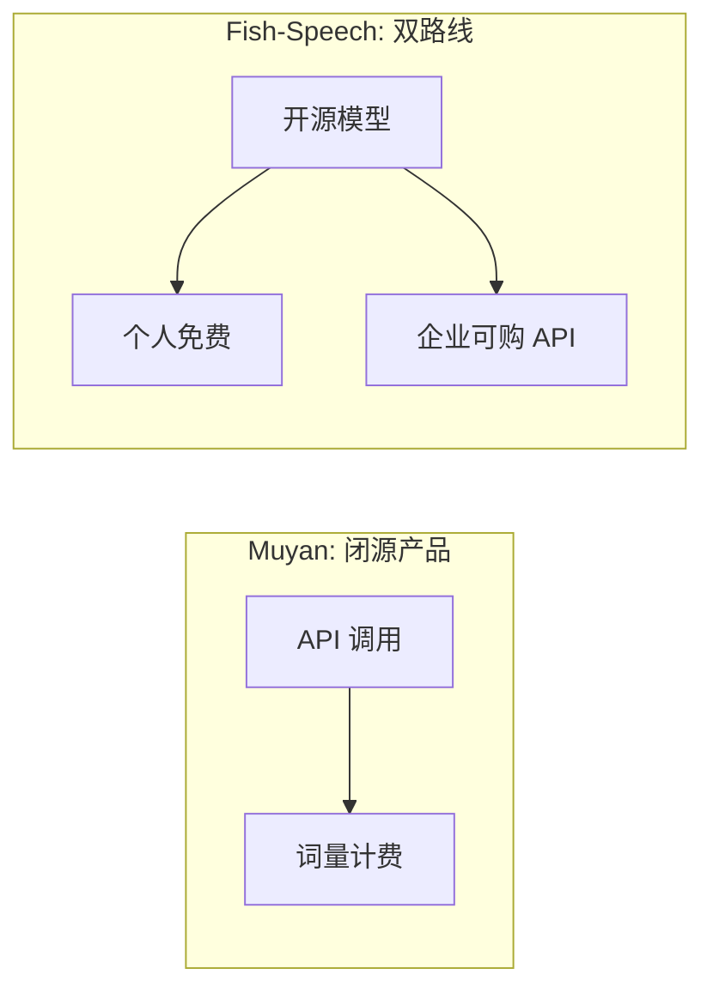

## 前置知识

> [!important]
> 
> 先读：[[私人与共享/Fish-Speech 系列 TTS 全栈总纲/11. 与同期主流 TTS 的对比|11. 与同期主流 TTS 的对比]]。

---

## 11.4.0 定位

> 一句话：Muyan-TTS （踏出智能 2024）与 Fish-Speech 同为中国语音创业公司产出、采用 LLM-style 架构的 TTS。

---

## 11.4.1 Muyan 架构概述

|维度|详情|
|---|---|
|语言模型|Llama-3 (0.5B / 1B)|
|语音表示|**多层 RVQ**（16 codebook）|
|声码器|**HiFi-GAN 变体**|
|生成范式|单 AR（预测全部 codebook）|
|语种|中/英/日 (3)|
|License|**闭源**|

---

## 11.4.2 与 Fish-Speech 对比

|维度|Muyan-TTS|Fish-Speech S2-Pro|
|---|---|---|
|语音 codebook|16 (RVQ)|**8 (GFSQ)**|
|AR 结构|单 AR|**Dual-AR**|
|需要序列长度|16 起 / token|**8 起 / token**|
|推理速度|0.18 RTF|**0.10 RTF**|
|UTMOS|4.20|**4.32**|
|语种|3|**13+**|
|开放性|闭源 API|开源模型|

---

## 11.4.3 商业模式

> [!important]
> 
> Muyan 采用**纯商业模式**，不公开模型。Fish-Speech 采用**双路线**：开源使社区发展 + API 产生企业收入。

---

## 11.4.4 技术上的差别点

> [!important]
> 
> 1. **codebook 个数**：Muyan 采用 16 个 RVQ codebook，以补偿质量；Fish-Speech 采用 8 个 GFSQ，质量同等但序列更短。
> 
> 1. **AR 结构**：Muyan 预测 16× token，计算鬼却高；Fish-Speech Dual-AR 拆分 1+7 预测，颗粒度更高。
> 
> 1. **语种**：Muyan 3 语使能心为中日韩；Fish-Speech 13+ 面向全球。

---

## 11.4.5 完结

> [!important]
> 
> Muyan 在中文 TTS 质量上表现不错，但闭源 + 商业限制使其在社区听点上较轻。Fish-Speech 以开源 + 高质 + 13 语种 获得全球社区。
> 
> 两者对比实则是 「商业闭源 + 足够好」 vs 「开源 + 最佳」的路线代表。

---

## 参考文献

1. Tashang Intelligence. _Muyan-TTS Technical Report_, 2024.

1. Fish Audio. _Fish-Speech S2-Pro Whitepaper_, 2025.