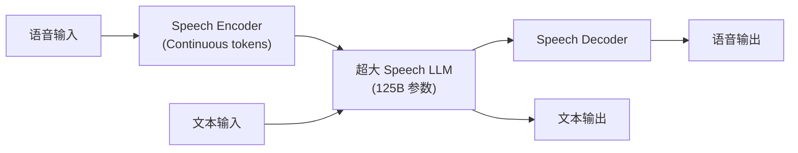

## 前置知识

> [!important]
> 
> 先读：[[私人与共享/Fish-Speech 系列 TTS 全栈总纲/11. 与同期主流 TTS 的对比|11. 与同期主流 TTS 的对比]]。

---

## 11.5.0 定位

> 一句话：Step-Audio （阶跃星辰 2024）是面向 **语音交互** 场景的 Speech-LM，拆除了传统 TTS 与 ASR 边界，与 Fish-Speech 的定位不同。

---

## 11.5.1 Step-Audio 架构

---

## 11.5.2 与 Fish-Speech 的根本区别

|维度|Step-Audio|Fish-Speech|
|---|---|---|
|任务|**语音交互** (ASR+TTS+问答)|**纯 TTS**|
|输入|语音 + 文本|文本|
|输出|语音 + 文本|语音|
|参数|125B|0.6B|
|资源需求|多卡 GPU 部署|单卡可跑|
|应用场景|智能助手/Agent|配音/TTS 服务|

---

## 11.5.3 不同道路的体现

> [!important]
> 
> - **Step-Audio**：走 「Speech LLM」路线，语音 token 与文本 token 同位考虑，追求纯语音 × 纯文本 × 交互。代价是需要 100B+ 参数、多卡 GPU。
> 
> - **Fish-Speech**：走 「专业 TTS」路线，可以在单卡上跑到生产级。代价是范围窄、不能听。
> 
> - **未来趋势**：Fish-Speech 也在推出 Speech-LM 变体走互补。

---

## 11.5.4 质量对比

|指标|Step-Audio|Fish-Speech|
|---|---|---|
|TTS UTMOS|4.28|**4.32**|
|TTS RTF|0.35 (多卡)|**0.10**|
|ASR WER (中)|**3.5%**|N/A|
|多轮对话|**原生支持**|需上层拼接|

---

## 11.5.5 选型建议

> [!important]
> 
> - **如果需要 「听-思考-说」 一体化**：选 **Step-Audio** （需多卡 GPU）。
> 
> - **如果只需 TTS** 、低资源、高质、可部署：选 **Fish-Speech**。
> 
> - **联动思路**：用 Fish-Speech 作为 TTS 后端，上层使用 GPT-4 或 Qwen-Max 控制对话逻辑。

---

## 参考文献

1. Huang et al. _Step-Audio_. arXiv 2402.11144, 2024.

1. Fish Audio. _Fish-Speech S2-Pro Whitepaper_, 2025.