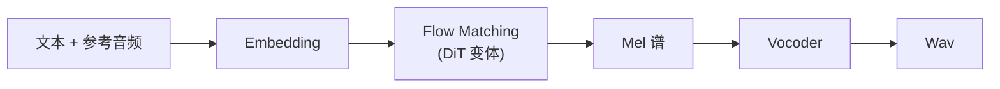

## 前置知识

> [!important]
> 
> 先读：[[私人与共享/Fish-Speech 系列 TTS 全栈总纲/11. 与同期主流 TTS 的对比|11. 与同期主流 TTS 的对比]]。

---

## 11.6.0 定位

> 一句话：F5-TTS（上海交大 2024）采用 **Flow Matching** 路线，与 Fish-Speech 的 AR 路线代表了两种不同的 zero-shot TTS 生成范式。

---

## 11.6.1 F5-TTS 架构

---

## 11.6.2 AR vs Flow Matching

|维度|F5-TTS (Flow Matching)|Fish-Speech (AR)|
|---|---|---|
|生成范式|**非自回归**|**自回归**|
|推理步数|16-32 步 ODE|$T$ 个 token|
|TTFB|全调后输出|**逐 token 输出**|
|流式输出|不支持|**原生支持**|
|质量|4.30 UTMOS|4.32 UTMOS|
|RTF|0.12|**0.10**|

---

## 11.6.3 Flow Matching 原理

$$\frac{d\mathbf{x}_t}{dt} = v_\theta(\mathbf{x}_t, t)$$

从高斯噪声 $\mathbf{x}_0 \sim \mathcal{N}(0, I)$ 出发，求解 ODE 到目标分布 $\mathbf{x}_1$。

> [!important]
> 
> Flow Matching 与 Diffusion 在理论上同等，但 Flow Matching 可在 16-32 步内生成，远快于 Diffusion 的 1000 步。

---

## 11.6.4 F5 与 Fish-Speech 的优劣

|场景|F5|Fish-Speech|
|---|---|---|
|离线批生成|**优**|中|
|实时对话|劣 (需生成全部后输出)|**优**|
|超长句生成|优|中|
|多说话人|部分|**原生**|
|NL Tags|不支持|**支持**|

---

## 11.6.5 选型建议

> [!important]
> 
> - **离线批量生成** (有声书 / 配音)：两者皆可，F5 越稳定。
> 
> - **实时语音 / Agent / 智能客服**：选 Fish-Speech (流式 + 低 TTFB)。
> 
> - **多话者 + NL Tags**：选 Fish-Speech。

---

## 参考文献

1. Chen et al. _F5-TTS_. arXiv 2410.06885, 2024.

1. Lipman et al. _Flow Matching_. ICLR 2023.

1. Fish Audio. _Fish-Speech S2-Pro Whitepaper_, 2025.