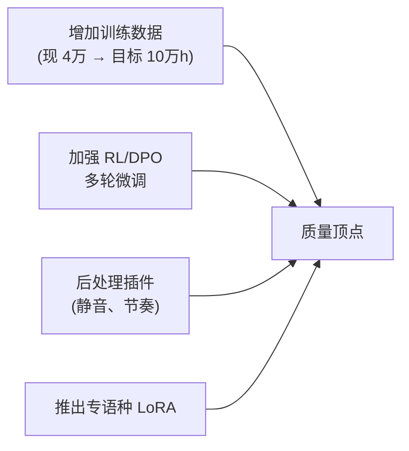

## 前置知识

> [!important]
> 
> 先读：[[私人与共享/Fish-Speech 系列 TTS 全栈总纲/11. 与同期主流 TTS 的对比|11. 与同期主流 TTS 的对比]]。

---

## 11.7.0 定位

> 一句话：ElevenLabs 是最成熟的闭源商业 TTS，Fish-Speech 是最接近「开源版 ElevenLabs」的项目。

---

## 11.7.1 ElevenLabs 架构（推测）

ElevenLabs 不公开架构细节，但根据公开 demo 与 API 推测：

- LLM-style speech generation (似 VALL-E)

- 类似 GFSQ 的语音 token化

- 广泛 RL 微调与商业数据反馈

---

## 11.7.2 能力全面对比

|能力|ElevenLabs|Fish-Speech S2-Pro|
|---|---|---|
|UTMOS|**4.45**|4.32|
|SECS|**0.82**|0.78|
|语种|**29**|13+|
|NL Tags|部分 (Settings API)|inline tag|
|多说话人|需 "voice" 拼接|**原生支持**|
|实时流式|**优**|优|
|价格|$0.30 / 1k char|**开源免费**|
|License|闭源 API|CC-BY-NC-SA + 企业 API|

---

## 11.7.3 质量差距分析

> [!important]
> 
> ElevenLabs 仍领先 0.10-0.15 UTMOS / 0.04 SECS，但差距远小于价格差距。主要原因：
> 
> - **训练数据**：ElevenLabs 据估超 10万小时、包含专业配音师。
> 
> - **产品打磨**：三年发布迭代、用户反馈闭环。
> 
> - **后处理**：闭源 pipeline 可能含静音控制、着重调节等后处理。

---

## 11.7.4 Fish-Speech 如何超越

---

## 11.7.5 选型建议

> [!important]
> 
> - **需要极致质量 + 不介作价格**：选 ElevenLabs。
> 
> - **需控制成本 + 加入个人 LoRA + 可部署**：选 Fish-Speech。
> 
> - **企业场景**：以 ElevenLabs 为 baseline，避免锁定供应商，同时部署 Fish-Speech 作为备选。

---

## 参考文献

1. ElevenLabs. _API Documentation_, 2024.

1. Fish Audio. _Fish-Speech S2-Pro Whitepaper_, 2025.