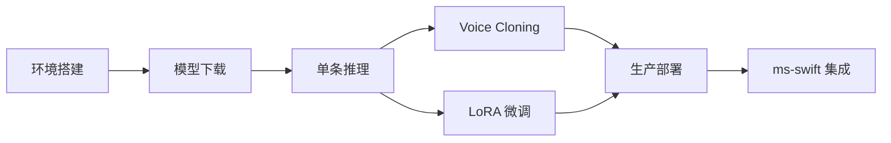

## 0. 定位

> 一句话：本章是「从环境到生产」的全流程实战手册：环境、模型下载、推理、Voice Cloning、LoRA 微调、SGLang+Docker 部署、与主流 LLM 训练框架（ms-swift）的集成思路。

---

## 1. 实战路径

---

## 2. 子页面导航

[[12.1 环境搭建]]

[[12.2 模型下载（HuggingFace - ModelScope）]]

[[12.3 单条推理示例]]

1. Fish Audio. _Fish-Speech Production Deployment Guide_, 2024.

[[12.7 与 ms-swift 生态的潜在集成]]

1. ModelScope. _ms-swift Documentation_, 2024.

---

## 3. 场景面抨荐堆栈

|场景|推荐堆栈|关键品质点|
|---|---|---|
|本地体验|conda + Gradio WebUI|CUDA 版本、torch 匹配|
|单机服务|SGLang-Omni 单 GPU|BF16 原版足够|
|生产集群|SGLang + TensorRT + Docker|**量化 + 流式**|
|定制训练|ms-swift / Megatron-LM|LoRA 优先，全参谨慎|

> [!important]
> 
> 许可证：CC-BY-NC-SA 4.0 仅限非商业。商用请联系 Fish Audio。

---

## 4. 参考文献

[[12.4 Voice Cloning 实战]]

[[12.5 LoRA 微调实战]]

[[12.6 生产部署（SGLang + Docker）]]