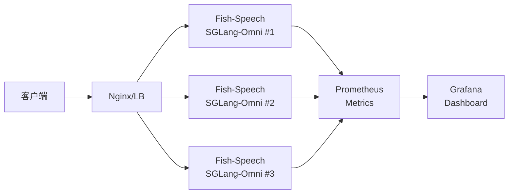

## 前置知识

> [!important]
> 
> 先读：[[7.2 阶段二：Dual-AR 大规模预训练]]。

---

## 12.6.0 定位

> 一句话：生产部署重点是「高吞吐 + 可重咽 + 可观测」，SGLang + Docker 是官方推荐组合。

---

## 12.6.1 架构图



---

## 12.6.2 Dockerfile

```docker
FROM nvidia/cuda:12.1.0-cudnn8-runtime-ubuntu22.04

RUN apt update && apt install -y python3.10 python3-pip ffmpeg git
RUN pip install torch==2.4.1 --index-url https://download.pytorch.org/whl/cu121

WORKDIR /app
COPY . /app
RUN pip install -e .[stable]

EXPOSE 8000
CMD ["python", "-m", "fish_speech.server", \
     "--checkpoint", "checkpoints/openaudio-s2-pro", \
     "--engine", "sglang", \
     "--port", "8000"]
```

---

## 12.6.3 docker-compose.yml

```yaml
version: "3.8"
services:
  fish-speech:
    image: fishaudio/fish-speech:s2-pro
    deploy:
      replicas: 3
      resources:
        reservations:
          devices:
            - driver: nvidia
              count: 1
              capabilities: [gpu]
    ports:
      - "8000-8002:8000"
    environment:
      - SGLANG_BATCH_SIZE=8
      - SGLANG_MAX_TOKENS=2048
    volumes:
      - ./checkpoints:/app/checkpoints
  prometheus:
    image: prom/prometheus
    ports: ["9090:9090"]
  grafana:
    image: grafana/grafana
    ports: ["3000:3000"]
```

---

## 12.6.4 Nginx 负载均衡

```jsx
upstream fish_speech {
    least_conn;
    server fish-speech-1:8000 max_fails=2 fail_timeout=30s;
    server fish-speech-2:8000 max_fails=2 fail_timeout=30s;
    server fish-speech-3:8000 max_fails=2 fail_timeout=30s;
}
server {
    listen 80;
    location /v1/tts {
        proxy_pass http://fish_speech;
        proxy_buffering off;  # 流式重要
        proxy_read_timeout 300s;
    }
}
```

---

## 12.6.5 可观测

> [!important]
> 
> **需实时监控的指标**：
> 
> - RTF、TTFB、RPS、P99 延迟
> 
> - GPU 利用率、显存
> 
> - HTTP 200/4xx/5xx
> 
> - queue 长度、请求流入速率
> 
> - vocoder 失败率

```python
from prometheus_client import Counter, Histogram

REQ_COUNT = Counter("tts_requests_total", "总请求数")
LATENCY = Histogram("tts_latency_seconds", "延迟")

@app.post("/v1/tts")
def tts(req):
    REQ_COUNT.inc()
    with LATENCY.time():
        return generate(req)
```

---

## 12.6.6 结合 K8s

```yaml
# k8s/deployment.yaml
apiVersion: apps/v1
kind: Deployment
metadata:
  name: fish-speech
spec:
  replicas: 5
  selector:
    matchLabels:
      app: fish-speech
  template:
    spec:
      containers:
      - name: fish-speech
        image: fishaudio/fish-speech:s2-pro
        resources:
          limits:
            nvidia.com/gpu: 1
        readinessProbe:
          httpGet:
            path: /healthz
            port: 8000
```

---

## 12.6.7 生产检查列表

> [!important]
> 
> - ✅ 启用 SGLang-Omni (不要用 vanilla PyTorch)
> 
> - ✅ 设置合适 batch_size (8-32)
> 
> - ✅ Nginx proxy_buffering off (保证流式)
> 
> - ✅ 启用 Prometheus + Grafana
> 
> - ✅ 设置合适的超时 (300s, 考虑长句)
> 
> - ✅ 热换机制 (rolling deploy，不中断)
> 
> - ✅ 备份 checkpoints 与 LoRA

---

## 参考文献

1. Fish Audio. _Production Deployment Guide_, 2025.

1. SGLang Team. _SGLang Documentation_, 2024.

1. Kubernetes. _GPU Scheduling_, 2024.