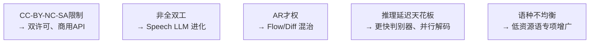

## 0. 定位

> 一句话：本章诚实记录 Fish-Speech 在**许可证**、**架构范式**、**深度能力**、**延迟**、**多语种均衡**五个维度上的局限与未来可能的演进路线。

---

## 1. 五项局限与未来方向

---

## 2. 子页面导航

[[13.1 CC-BY-NC-SA 4.0 的商用限制]]

[[13.2 与全双工 Speech LLM 的差异]]

[[13.3 与端到端 Flow - Diffusion 融合的可能性]]

---

## 3. 思辨总结

> [!important]
> 
> 1. **许可证** 是 Fish-Speech 生态中最现实的压力：CC-BY-NC-SA 限制了企业采用，双许可路线（社区免费 + 商用付费）是可预期的未来。
> 
> 1. **全双工** 是 Speech LLM（GPT-4o realtime、Step-Audio）的下一站，Fish-Speech 当前的「送一句话调一句话」范式需升级为「随时插嘴」。
> 
> 1. **AR 与 Flow Matching** 互补：AR 适合少 token 、可控；Flow 适合高保真、不依赖顺序。未来可能出现「**AR 生 token + Flow 生波形**」的混合架构。

---

## 4. 参考文献

1. OpenAI. _GPT-4o System Card_, 2024.

1. Defossez et al. _Moshi_. 2024.

[[13.4 推理延迟天花板]]

1. F5-TTS, _Flow Matching for Generative Speech Synthesis_, 2024.

[[13.5 多语种数据不均衡]]