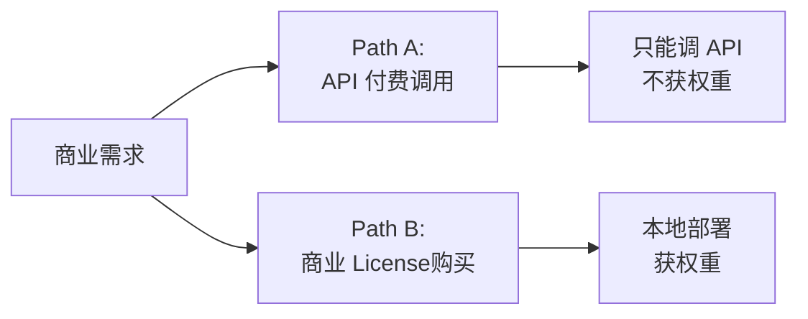

## 前置知识

> [!important]
> 
> 先读：[[13. 局限性与未来方向]]。

---

## 13.1.0 定位

> 一句话：License 是 Fish-Speech 生态最大的「多谈」，它同时是社区动不反「免费 + 开源」的型制与商业不能商用的限制。

---

## 13.1.1 当前 License

> [!important]
> 
> Fish-Speech 以 **CC-BY-NC-SA 4.0** 发布。含义：
> 
> - **BY**：必须标注原作者 (Fish Audio)。
> 
> - **NC**：**不准商业使用**。
> 
> - **SA**：改进后也需以同许可发布 (Share-Alike)。

---

## 13.1.2 商业使用限制的影响

|场景|允许吗|
|---|---|
|个人玩|✅ 允许|
|科研论文|✅ 允许|
|社区 Demo|✅ 允许|
|公司内部手动配音|⚠ 灯区|
|公司产品发布|❌ 不允许|
|SaaS 对外提供 TTS|❌ 不允许|
|应用中嵌入|⚠ 不允许（产品是商业行为）|

---

## 13.1.3 商业许可路径

Fish Audio 提供两种商用选项：

---

## 13.1.4 许可争议点

> [!important]
> 
> - **社区不满**：许多人期待 Apache 2.0 / MIT，以便商用。CosyVoice (Apache) 生态上占优。
> 
> - **购买门槛**：需 联系 Fish Audio 销售，没有公开价格表。中小企业购买未决。
> 
> - **跨国各地同合压定**： CC-BY-NC-SA 在企业法律中不如 SPDX 许可容易接受。

---

## 13.1.5 未来可能走向

> [!important]
> 
> - **分纪 License**：另发布商业友好的 mini 版（质量少略低，Apache）。
> 
> - **Open-Weight 补补**：发布「研究用途」的完整 checkpoint，同时推出商业 tier。
> 
> - **走 Llama 3 路线**：发布 「Fish-Speech Community License」，允许 < N 万 MAU 免费商用。

---

## 13.1.6 与同类项目的商业占位

|项目|许可|商业不友好|
|---|---|---|
|**CosyVoice 2/3**|Apache 2.0|✅ 商用|
|**GPT-SoVITS**|MIT|✅ 商用|
|**Fish-Speech**|CC-BY-NC-SA|❌ 需另购|
|**Step-Audio**|部分开源|⚠|
|**OpenAI TTS**|闭源 API|✅ 付费|

> [!important]
> 
> Fish-Speech 是质量领先但许可限制严。公司使用需充分考量。

---

## 参考文献

1. Creative Commons. _CC-BY-NC-SA 4.0_, 2024.

1. Fish Audio. _License FAQ_, 2025.