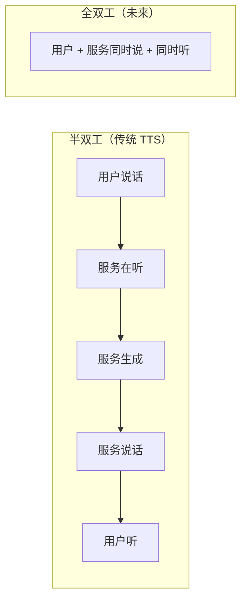
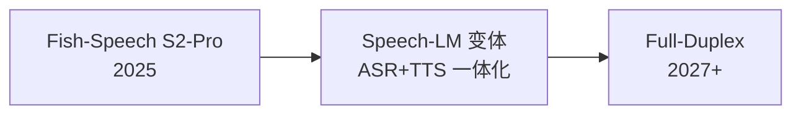

## 前置知识

> [!important]
> 
> 先读：[[13. 局限性与未来方向]]。

---

## 13.2.0 定位

> 一句话：全双工（full-duplex）是「人身口话」的最后一公里。2026 年后 Fish-Speech 需调整架构才能走到该场景。

---

## 13.2.1 什么是全双工

> [!important]
> 
> 全双工需要模型同时拥有 ASR + TTS + 中断检测，以及「说一半被打断后能优雅重起」的能力。

---

## 13.2.2 现状：半双工架构

|阶段|延迟|
|---|---|
|ASR 转录|200-500 ms|
|LLM 推理|500-1500 ms|
|Fish-Speech TTS|200-300 ms TTFB|
|**总接听到开口**|**~ 1000-2000 ms**|

> [!important]
> 
> 人调人互话双方转换在 200ms 内，2000ms 是「明显机械」的体验。

---

## 13.2.3 全双工所需能力

> [!important]
> 
> 1. **流式 ASR**：Whisper-Stream / 自判句末。
> 
> 1. **中断检测**：VAD 检测用户开口 → 口令 TTS 提前停。
> 
> 1. **快速重起**：被中断后，从中断点以为上下文重新启动。
> 
> 1. **语音 LLM**：ASR 与 TTS 合为一个模型（可并行听说）。
> 
> 1. **低延迟**：TTFB 需 < 100 ms。

---

## 13.2.4 Fish-Speech 与全双工的距离

|能力|现状|需改造|
|---|---|---|
|流式输出|✅|-|
|TTFB < 200ms|✅|-|
|中断接口|⚠ 需上层拼接|原生支持|
|ASR 集成|❌|联动 Whisper-Stream|
|语音 LLM|❌|架构重定补|

---

## 13.2.5 预期路径图

---

## 13.2.6 现阶段变通方案

> [!important]
> 
> 在 Fish-Speech 原生不支持全双工前，可以采用：
> 
> 1. **上层 VAD + 选择性中断**：检测到用户说话 → 调 Fish-Speech 的 stop API。
> 
> 1. **TTS-LM 上层**：使用 GPT-4 / Qwen-Max 控制对话逻辑，调用 Fish-Speech 发声。
> 
> 1. **预生成**：遇到 「用户走在未说」时，预生成 1-2 个句子缓存。

---

## 参考文献

1. Zhang et al. _Full-Duplex Dialog Systems_. ACL 2024.

1. OpenAI. _GPT-4o Realtime API_, 2024.