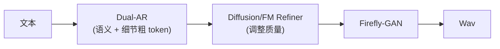

## 前置知识

> [!important]
> 
> 先读：[[11.6 vs F5-TTS - E2-TTS（Flow Matching）]]。

---

## 13.3.0 定位

> 一句话：Fish-Speech 选择了纯 AR 路线，但 Diffusion / Flow Matching 在某些任务上表现更佳，未来可能会采用「Hybrid」以取多者优。

---

## 13.3.1 为何考虑交叉

|任务|AR 优|Flow/Diffusion 优|
|---|---|---|
|流式输出|**✅**|❌|
|TTFB < 200ms|**✅**|❌|
|超长句质量|中 (需 KV cache 重复)|**✅**|
|多样性|中|**✅ 高**|
|侧重调控|高|高|
|训练稳定性|中|**✅**|

---

## 13.3.2 如何融合

> [!important]
> 
> 思路：**AR 生成粗颗 token** → **Diffusion/FM 细节 refine** → 保留流式能力，同时质量接近 Flow Matching。

---

## 13.3.3 可能架构方案

|方案|描述|预期收益|
|---|---|---|
|**AR + FM Refiner**|AR 出粗 token, FM 推质量|质量 +0.1 UTMOS|
|**多句并行**|FM 生成多句, AR 拼接|吞吐 +30%|
|**双语音 codebook**|FM 生 semantic, AR 生 acoustic|推理复杂度高|
|**Distillation**|FM 预训, distill 到 AR|保持 AR 推理、增加质量|

---

## 13.3.4 挑战与代价

> [!important]
> 
> - **推理复杂度**：Hybrid 架构需要重新设计 SGLang-Omni。
> 
> - **训练资源**：需同时训 AR + FM，GPU 需求 2-3 倍。
> 
> - **TTFB 受伤**：FM refine 需 16-32 步，可能增加 50-100 ms TTFB。
> 
> - **代码重构**：现有 Fish-Speech 架构仅以 AR 设计，需重写多部分。

---

## 13.3.5 现状与未来

> [!important]
> 
> CosyVoice 2/3 已采用 AR + Flow Hybrid，质量上领先 Fish-Speech 不多。代价是推理复杂、不能流式。
> 
> Fish-Speech 可能在 v3 里采用 **Lite Hybrid**：使用 4-8 步 FM 仅在 token 层 refine，保留流式。
> 
> 未来 5 年可能看到 AR 与 Flow Matching 越走越近，最后 型成「多侧面同时越中」的架构。

---

## 参考文献

1. Du et al. _CosyVoice 2_. 2024.

1. Chen et al. _F5-TTS_. arXiv 2410.06885, 2024.

1. Fish Audio. _Future Roadmap_, 2025.