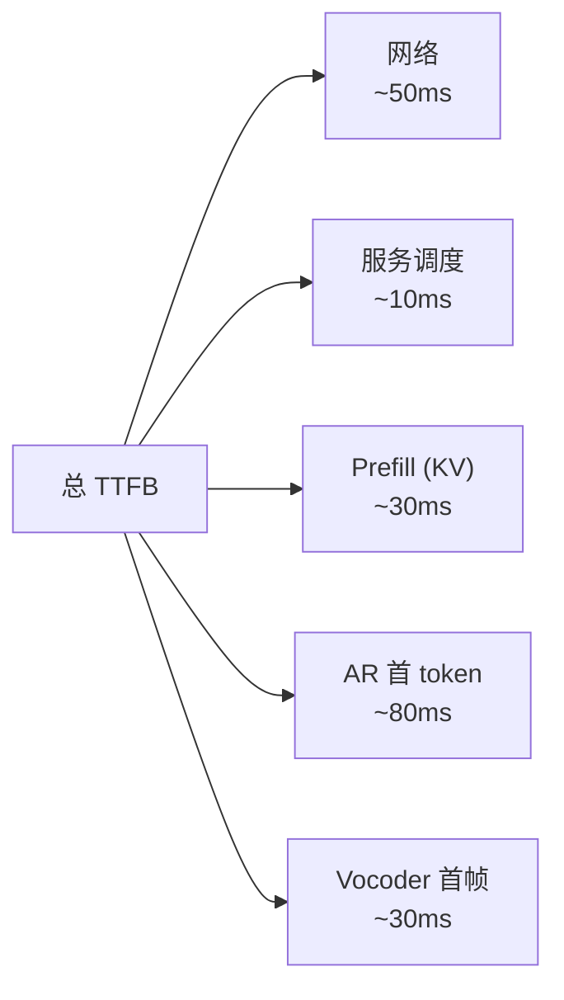

## 前置知识

> [!important]
> 
> 先读：[[8.1 SGLang-Omni Serving]]、[[13. 局限性与未来方向]]。

---

## 13.4.0 定位

> 一句话：在「交互式 / Agent / 智能客服」场景，延迟是 Fish-Speech 仍然要打磨的「最后点」，TTFB 需从 200ms 走到 50-100ms。

---

## 13.4.1 延迟预算拆解

> [!important]
> 
> 总 TTFB 约 200ms。决定性点：**AR 首 token + prefill**。

---

## 13.4.2 该着在哪

|点|当前|改进后目标|路径|
|---|---|---|---|
|AR 首 token|80ms|**40ms**|Mamba/Linear AR|
|Prefill|30ms|10ms|FlashAttention 3|
|Vocoder 首帧|30ms|10ms|迭代 GAN|
|服务调度|10ms|5ms|SGLang 优化|
|网络|50ms|20ms|WebRTC / QUIC|

---

## 13.4.3 Linear AR 可能性

> [!important]
> 
> - **Mamba (SSM)**：O(N) 推理。质量在语言任务上与 Transformer 类似，在 TTS 上未验证。
> 
> - **Linear Attention**：KV cache 微型。质量略低，需 ablation。
> 
> - **Hybrid Mamba+Transformer**：少部分 Transformer + 主要 Mamba，可以平衡质量与速度。

---

## 13.4.4 推理引擎优化

> [!important]
> 
> 1. **Speculative Decoding**：小模型 draft 出 token，大模型验证。预期 TTFB -30%。
> 
> 1. **Continuous Batching**：全局应对 batch 从全部同时生成 → token 粒度 batch。
> 
> 1. **CUDA Graph**：预包 CUDA 调用 → kernel launch 延迟 -40%。
> 
> 1. **FP8 Inference**：H100 可用，进一步减半。
> 
> 1. **专用 vocoder ASIC**：未来可能出现。

---

## 13.4.5 网络层优化

|手段|收益|
|---|---|
|HTTP/2 streaming|默认|
|WebSocket|-10 ms|
|WebRTC SCTP|-30 ms|
|QUIC|-20 ms|
|边缘部署|-50 ms|

---

## 13.4.6 未来期望

> [!important]
> 
> - **2025**：TTFB 200ms (现状)
> 
> - **2026**：TTFB 100ms (SGLang-Omni v2 + Speculative)
> 
> - **2027**：TTFB 50ms (Mamba + FP8 + Edge)
> 
> - **理论下限**：人耳感知延迟 30ms，该上限是距离的。

---

## 参考文献

1. Gu & Dao. _Mamba_. arXiv 2312.00752, 2023.

1. Leviathan et al. _Speculative Decoding_. ICML 2023.

1. Dao et al. _FlashAttention-3_. 2024.