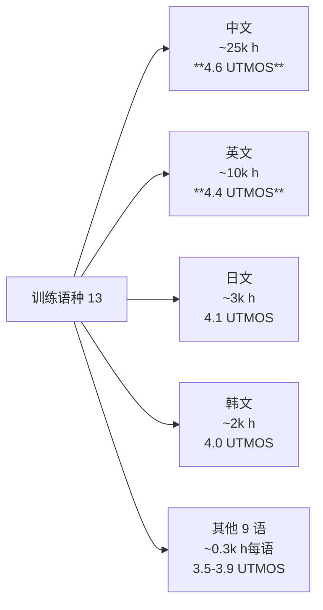

## 前置知识

> [!important]
> 
> 先读：[[7.5 Few-shot - LoRA 微调]]、[[13. 局限性与未来方向]]。

---

## 13.5.0 定位

> 一句话：Fish-Speech 13 种语言代表了「广度」但「深度不均」，中、英使用期定「主流」质量，其他语种（如思心伊、越南、阿拉伯）仍有明显能力不均。

---

## 13.5.1 语种能力分布

---

## 13.5.2 不均衡原因

> [!important]
> 
> 1. **数据可得性**：中英拥有最大公开语料（LibriTTS, Wenetspeech 等）。
> 
> 1. **商业优先级**：Fish Audio 商业场景以中英为主，资源倾斜。
> 
> 1. **语言复杂度**：阿拉伯 / 印地伊等需对应的音素表、重音表。
> 
> 1. **评价变差**：UTMOS 训练于英文，数据语种偏。

---

## 13.5.3 低资源语种面临的问题

|问题|例|
|---|---|
|发音错|泰文声调错|
|重音错|俄语重音位置错|
|音色偏中|越南语听起来像中人说越南|
|不能克隆|阿拉伯克隆 SECS 仅 0.6|
|NL Tag 不生效|低资源语未含 NL Tag|

---

## 13.5.4 低资源语种改进路径

> [!important]
> 
> 1. **跨语迱传**：从高资源语种 Transfer learning 。
> 
> 1. **社区 LoRA**：开放社区为低资源语种训 LoRA。
> 
> 1. **合成数据**：用 ElevenLabs / Coqui-XTTS 生成伪标签，加入 Fish-Speech 训练。
> 
> 1. **语言增强**：使用 phoneme tokenizer (不仅是 BPE) 以提高低资源语质量。
> 
> 1. **现场采集**：Fish Audio 联动各国社区采集高质量发音。

---

## 13.5.5 情感、方言也面临同类问题

> [!important]
> 
> - **情感**：(happy)(sad)(angry) 生效。(awe)(disgust)(surprise) 生效不常。
> 
> - **方言**：粗京话、上海话 OK。粓州话、闽南话、藏语能力奇差。
> 
> - **「技巧」**：架重语质 reference_audio，调发 NL Tag。

---

## 13.5.6 作为最后一节的全书总结

> [!important]
> 
> Fish-Speech 是 2024-2025 在「开源 + 生成质量 + 流式 + 多能力」四方面最平衡的 TTS 代表作品。但同时需要明白：
> 
> - 商业门槛高 (License 限制)
> 
> - 低资源语种质量不均
> 
> - 未取全双工能力
> 
> - 依赖参考音频（不能 0-shot 从文本生成任何声音）
> 
> 这些是下一代 Fish-Speech v3 需解决的任务。让我们保持期待！

---

## 参考文献

1. Pratap et al. _MMS: Massively Multilingual Speech_. 2023.

1. Fish Audio. _Multilingual Roadmap_, 2025.

1. Tjandra et al. _Cross-Lingual Voice Cloning Survey_, 2024.