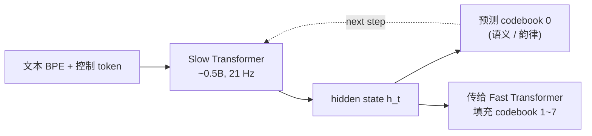

## 前置知识

> [!important]
> 
> 阅读本页前建议先读：[[2. 核心架构：Dual-AR（双自回归）]]、[[3. 语音 Tokenizer：GFSQ]]。理解 GFSQ 的 8 路 codebook 划分，再回头看 Slow 为何只负责其中一路。

---

## 2.1.0 定位

> 一句话：**Slow Transformer**（慢速自回归层）= Dual-AR 中以 **21 Hz 频率** 逐步预测 **codebook 0 语义 token** 的大块 Llama-style 解码器，每一步对应约 48 ms 的语音内容，承担「读什么字、用什么语调、什么时候停顿」的全部语义/韵律决策。

---

## 2.1.1 为什么需要「慢」的语义层

> [!important]
> 
> 单 AR 在 75 Hz × 8 codebook 下需要 600 步/秒前向，TTFB 高达 700 ms。Dual-AR 提出的核心观察是：
> 
> 1. **语义信息变化慢**：文本「今天」对应约 250 ms 范围内的语义 token 几乎不变。
> 
> 1. **声学细节变化快**：同一音节内部的频谱包络、共振峰、谐波是 5–10 ms 量级。
> 
> 1. **二者强行同频** → AR 浪费大量算力重复预测同样的语义。
> 
> 拆分后，Slow 在低频率（21 Hz）专注做「决策」，Fast 在每个 Slow step 内用 7 步并行小循环填充声学细节。

---

## 2.1.2 输入与输出规格

|项目|规格|说明|
|---|---|---|
|输入 token|文本 BPE + 控制 token + 历史 codebook 0|拼接顺序见 [[2.3 输入序列拼接格式]]|
|输出|codebook 0 的 1024 类分类分布|softmax over 1024 entries|
|频率|21 Hz（S1+）/ 25 Hz（V1.5）|每步约 40–48 ms|
|参数量|~0.5B（V1.5）/ 0.5–1.5B（S1+ Qwen2.5）|主要参数承载者|
|层数 / 维度|24 / 1024（V1.5）；24 / 1536（S1）|类 Llama 默认|
|位置编码|RoPE（base=500000，长文本友好）|见 [[5.2 RoPE 旋转位置编码]]|
|注意力|GQA + Flash-Attn 2|KV head 数 = 4–8|
|归一化 / 激活 / FFN|RMSNorm + SwiGLU|同 Llama-3|

---

## 2.1.3 在 Dual-AR 中的位置

每个 Slow step 输出两路：

1. **下一步 codebook 0 token**：用于自回归回填给自己。

1. **隐藏状态** $h_t$：作为 condition 传给 Fast Transformer，去并行预测剩下 7 路 codebook。

---

## 2.1.4 自回归预测目标

设 $c_{1:T}^{(0)}$ 为 codebook 0 token 序列，$x$ 为文本与参考音频 token，则 Slow 优化：

$$\mathcal{L}_{\text{slow}} = -\sum_{t=1}^{T} \log P_\theta\!\left(c_t^{(0)} \mid c_{<t}^{(0)},\ x\right)$$

实现层面就是标准 next-token 交叉熵，与 Llama 预训练完全一致。细节见 [[2.1.1 Decoder-only 自回归建模]]。

---

## 2.1.5 与 VALL-E 的 AR / NAR 路线对比

|方案|VALL-E 1（AR+NAR）|**Fish-Speech Slow**|
|---|---|---|
|codebook 0 建模|AR Transformer|**Slow AR（同 1 个）**|
|codebook 1~7 建模|NAR Transformer 全并行|**Fast AR 沿 codebook 维 AR**|
|训练目标|AR + NAR 双 loss|**统一 next-token CE**|
|推理顺序|先 AR 整段，再 NAR 一次性|**Slow → Fast 交替**|
|支持流式|❌（NAR 需 codebook 0 完整）|**✅ 每 Slow step 即可出声**|

> [!important]
> 
> 关键差别：VALL-E 的 NAR 需要 codebook 0 完全生成后才能开始；Fish-Speech 的 Fast 在 Slow 每一步后立刻并行展开，因此 **TTFB 与一句话总长解耦**——这是流式能成立的根本原因。

---

## 2.1.6 训练细节

> [!important]
> 
> 1. **Teacher forcing**：训练时 codebook 0 全部 ground-truth，Slow 仅做单步预测；推理时纯自回归。详见 [[2.1.2 Teacher Forcing 与训练目标]]。
> 
> 1. **KV-Cache**：21 Hz 的低频率意味着每秒只新增 21 个 KV 行；4096 context 可容纳约 195 s 历史。
> 
> 1. **冻结 tokenizer**：阶段二训练 Slow 时 GFSQ 与 Firefly-GAN 全部冻结，目标只是学「语义 → 离散 token」的映射。
> 
> 1. **学习率**：peak 2e-4，cosine 退到 1e-5，warmup 2000 step（与 Llama-3 类似）。

---

## 2.1.7 推理采样策略

|参数|典型值|过低后果|过高后果|
|---|---|---|---|
|temperature|0.7|朗读机感|音高乱飘|
|top-p|0.7|偶尔卡顿|漏字 / 重复|
|top-k|50|韵律单一|不必要的随机|
|repetition penalty|1.2–1.5|易卡在 padding|句末突然加速|

> [!important]
> 
> **常见误区**：把 Llama 文本生成的 `temperature=1.0` 直接套到 Slow → 韵律不稳，因为 codebook 0 的熵远低于自然语言 BPE。Fish-Speech 默认 0.7 是经验最优。

---

## 2.1.8 与文本 LLM 的复用关系

Slow Transformer 在结构上 **完全是一个 Llama-3 / Qwen2.5 解码器**，仅做了两点改造：

1. **扩词表**：在原 BPE 词表之外增加 1024 个 codebook 0 token，并预留 `<|prompt_audio|>` 等控制 token。

1. **位置编码**：RoPE base 从 10000 改 500000，支持长音频（30 s+）外推。

> [!important]
> 
> 这种「最小改动复用文本 LLM」的策略意味着 Fish-Speech 团队随时可以用最新的 Llama / Qwen 权重热替换 Slow，无需重训 Fast 和 Vocoder。S1 把 V1.5 的 Llama-0.5B 换为 Qwen2.5-1.5B 就是一个例证。

---

## 2.1.9 工程判断

> [!important]
> 
> 1. **Slow 是参数大头**：调参 / 量化 / KV-cache 优化都先打 Slow。
> 
> 1. **首包延迟敏感场景**：可把 Slow 用 INT8 / FP8，UTMOS 影响 < 0.05，TTFB 几乎减半。
> 
> 1. **Slow 不要随便扩大**：> 1.5B 后边际收益快速衰减，瓶颈转移到数据多样性。
> 
> 1. **不要单独训 Slow 而不动 GFSQ**：codebook 0 的分布会随 tokenizer 微调漂移，需联合或固定。

---

## 2.1.10 常见误区

> [!important]
> 
> **误区 1**：「Slow 只看文本，不看音频」——错。Slow 的 prompt 段同时拼了参考音频的 codebook 0 token，相当于「看到」音色与韵律 prior。
> 
> **误区 2**：「Slow 越大 MOS 越高」——错。V1.5 → S1 的 MOS 增益主要来自数据扩量与 RL 对齐，而非 Slow 加深。
> 
> **误区 3**：「Slow 输出可以直接喂 vocoder」——错。codebook 0 只是 GFSQ 八路之一，单路反量化得到的音频质量很差，必须经 Fast 补齐 1–7 路。

---

## 延伸阅读

- [[2.2 Fast Transformer（声学层）]]：与 Slow 串联的声学侧。

- [[2.3 输入序列拼接格式]]：Slow 实际看到的 token 流。

- [[2.4 KV-Cache 与首包延迟]]：Slow 推理优化主战场。

---

## 参考文献

1. Fish Audio. _Fish-Speech V1.5 Technical Report_, 2024-12.

1. Touvron et al. _Llama-2 / Llama-3 Technical Report_, 2023–24.

1. Bai et al. _Qwen2.5 Technical Report_, 2024.

1. Wang et al. _VALL-E: Neural Codec Language Models_. arXiv 2301.02111, 2023.

[[2.1.1 Decoder-only 自回归建模]]

[[2.1.2 Teacher Forcing 与训练目标]]