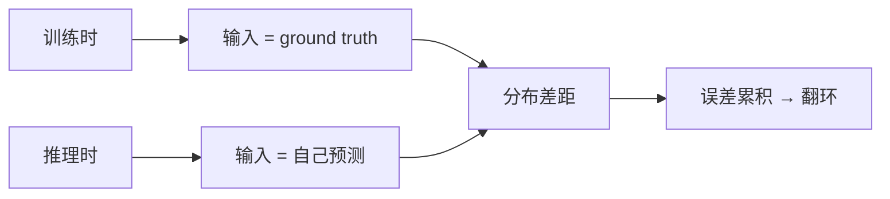

## 前置知识

> [!important]
> 
> 先读：[[2.1.1 Decoder-only 自回归建模]]。熟悉交叉熵 loss。

---

## 2.1.2.0 定位

> 一句话：Teacher Forcing 是 AR 训练的标准做法，但其**「exposure bias」**会在推理时闹例异。本页说明 Fish-Speech 如何缓解。

---

## 2.1.2.1 Teacher Forcing

训练时每个 step 的输入是**真实**的 ground-truth token，不是上一步预测：

$$h_i = \text{SlowModel}\!\left([T, P, a_1^*, a_2^*, \dots, a_{i-1}^*]\right)$$

其中 $a^*$ 表示 ground truth。优势：可以并行计算所有 step 的 logits，训练高效。

---

## 2.1.2.2 Exposure Bias



训练与推理的分布不一致可能导致推理时错误累积，在 TTS 上常表现为**偶状重复、含糊、長句崩坏**。

---

## 2.1.2.3 Fish-Speech 的缓解策略

> [!important]
> 
> 1. **Scheduled Sampling 不采用**：在 LLM-style 训练中颁布表明常起混乱。
> 
> 1. **Dropout on input**：以 5% 概率将输入 token 替为随机 token，增加鲁棒性。
> 
> 1. **Sampling temperature 控制**：推理时 temp = 0.8, top_p = 0.9，避免过锐分布。
> 
> 1. **重复检测机制**：连续生成 N 个相同 token 时 force 重 sample。

---

## 2.1.2.4 训练代码框架

```python
def train_step(batch, slow_model, fast_model):
    text_ids, prompt_ids, audio_ids = batch
    input_seq = concat([text_ids, prompt_ids, audio_ids[:-1]])
    target_seq = audio_ids[1:]
    
    # 并行计算所有 step
    hidden = slow_model(input_seq)              # (B, L, d)
    logits_0 = slow_head(hidden)                # codebook 0
    
    # Fast 生成 codebook 1-7
    fast_logits = fast_model(hidden, audio_ids) # (B, L, 7, V)
    
    loss_0 = ce_loss(logits_0, target_seq[..., 0])
    loss_rest = sum(ce_loss(fast_logits[..., k], target_seq[..., k]) for k in range(1, 8))
    
    loss = loss_0 + 0.5 * loss_rest             # 加权
    return loss
```

---

## 2.1.2.5 为什么 codebook 0 权重高

> [!important]
> 
> codebook 0 是低频大粒度信息，决定发音与语言内容。Loss 权重为 1。
> 
> codebook 1-7 是高频细节，重要性以几何级衰减。Fish-Speech 默认使用 0.5 的权重。

---

## 2.1.2.6 踩坑记录

> [!important]
> 
> **坑 1：input_seq 与 target_seq 偏移错误**——必须是 target = input shifted by 1。
> 
> **坑 2：loss 默认 reduce='mean' 难处理变长**，需 mask out padding token。
> 
> **坑 3：fp16 下 temperature 太低（0.3-）造成 underflow**，需 cast 到 fp32 计算 softmax。

---

## 参考文献

1. Bengio et al. _Scheduled Sampling for Sequence Prediction_. NeurIPS 2015.

1. Fish Audio. _Fish-Speech Technical Report_, 2024.