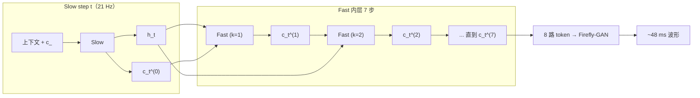
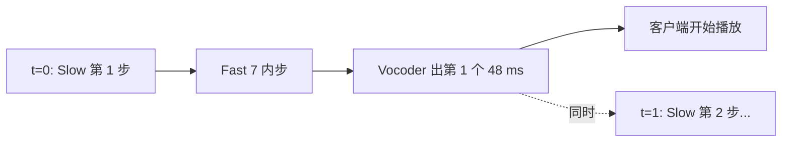

## 前置知识

> [!important]
> 
> 阅读本页前建议先读：[[2.1 Slow Transformer（语义层）]]、[[3. 语音 Tokenizer：GFSQ]]。理解 GFSQ 的 8 路 codebook 后再看 Fast 如何沿「codebook 维」做 AR。

---

## 2.2.0 定位

> 一句话：**Fast Transformer**（快速自回归层）= Dual-AR 中一个轻量（~0.1B）的 Llama-style 解码器，**在每个 Slow step 内沿 codebook 维做 7 步自回归**，并行地把 codebook 1~7 的声学细节填回去。Fast 的「时间维」频率与 Slow 完全一致（21 Hz），但每个时间步要跑 7 个内层步。

---

## 2.2.1 为什么不能让 Slow 一次预测 8 路

> [!important]
> 
> 直接让 Slow 在每步输出 8 个 codebook 的方案有两种实现，都不理想：
> 
> 1. **8 路独立 softmax**：codebook 之间无依赖，损失 GFSQ 内部的强相关（codebook 1–7 是对 codebook 0 残差的精细化），重建质量明显塌陷。
> 
> 1. **联合 softmax**：词表爆炸到 $1024^8 \approx 10^{24}$，根本无法学。
> 
> Fast Transformer 的解法：**让 codebook 维也走 AR**，每一步条件于「Slow 隐藏状态 + 当前时间步已生成的前 k 路」，用极小参数量恢复 codebook 间依赖。

---

## 2.2.2 输入与输出规格

|项目|规格|说明|
|---|---|---|
|输入|Slow hidden $h_t$ • 已生成 codebook $c_t^{(0..k-1)}$|k = 1..7 是内层 step|
|输出|当前时间步第 k 路 codebook 的 1024 类分布|每个 step 一路|
|内层 step 数|7 步（codebook 1 → 7）|codebook 0 由 Slow 给定|
|参数量|~0.1B|≈ Slow 的 1/5|
|层数 / 维度|4–6 / 768–1024|小模型|
|归一化 / 激活|RMSNorm + SwiGLU|同 Slow|
|位置编码|内层用 learned PE（仅 8 位）|codebook 维不长，无需 RoPE|

---

## 2.2.3 与 Slow 的串行接口

详细的串行接口设计（如 $h_t$ 怎么注入 Fast 的每一层、是否共享 embedding 等）见 [[2.2.2 Fast 与 Slow 的串行接口]]。

---

## 2.2.4 训练目标

> [!important]
> 
> Fast 的 loss 与 Slow 共享同一个全局优化目标，但只对 codebook 1–7 计算：

$$\mathcal{L}_{\text{fast}} = -\frac{1}{7}\sum_{t=1}^{T}\sum_{k=1}^{7} \log P_\phi\!\left(c_t^{(k)} \mid c_t^{(<k)},\ h_t\right)$$

总损失为 Slow + Fast 的加权和（见 [[7.2 阶段二：Dual-AR 大规模预训练]]）：

$$\mathcal{L} = \mathcal{L}_{\text{slow}} + \frac{1}{7}\mathcal{L}_{\text{fast}}$$

$\frac{1}{7}$ 的作用是防止 Fast 的 7 路梯度淹没 Slow 的单路梯度。

---

## 2.2.5 推理计算量分布

|每秒音频|Slow 前向|Fast 前向|Vocoder|
|---|---|---|---|
|1 s|21 步 × Slow（~0.5B）|21 × 7 = 147 步 × Fast（~0.1B）|1 次 Firefly-GAN|
|FLOPs 占比|~55%|~30%|~15%|

> [!important]
> 
> 直觉上 Fast 步数（147）远多于 Slow（21），但因为 Fast 参数量小 5×、KV-cache 长度只有 7，单步耗时约为 Slow 的 1/4。整体 FLOPs 仍由 Slow 主导。

---

## 2.2.6 与 RVQ「depthwise」建模的关系

> [!important]
> 
> 早期 RVQ 系统（如 SoundStorm、Encodec-LM）用一个 NAR Transformer 并行预测残差码本，称为「depthwise transformer」。Fast Transformer 与之的差别：
> 
> 1. **AR vs NAR**：Fast 是 AR（codebook 之间有显式依赖），depthwise 是 NAR（独立预测）。
> 
> 1. **建模容量**：Fast 是单个共享小 Transformer 重复 7 次，参数远少于 7 个 NAR 头。
> 
> 1. **质量**：在 GFSQ 上 AR 比 NAR 高约 0.10 UTMOS，因为 codebook 1–7 残差有显著序列结构。

---

## 2.2.7 Fast 与「流式」的关系

> [!important]
> 
> Fast 是 **TTFB ≤ 300 ms 能成立的关键**。VALL-E 用单一长 AR 预测所有 codebook，要等一句话生成完才能 vocoder。Fish-Speech 每个 Slow step（48 ms 音频）出 codebook 0 后，Fast 立即在约 30 ms 内补齐 1–7 路，Firefly-GAN 紧接着输出 48 ms 波形——**首帧只需 1 个 Slow step + 1 次 Fast 内循环 + 1 次 vocoder 解码**。

---

## 2.2.8 训练实战要点

> [!important]
> 
> 1. **dropout = 0.1**：Fast 参数小、又看高度相关的输入，容易过拟合。
> 
> 1. **teacher forcing**：训练时 $c_t^{(<k)}$ 全部 ground-truth，推理时纯 AR。
> 
> 1. **共享 token embedding 表**：Fast 与 Slow 共享 codebook embedding 表，可节省约 20% 参数并加速收敛。
> 
> 1. **学习率单独调**：Fast 用 5e-4 比 Slow 的 2e-4 略高，因为参数少 + 输入熵低，需要更激进的更新。
> 
> 1. **梯度裁剪**：Fast 的 7 步反传容易梯度爆炸，clip 至 1.0。

---

## 2.2.9 常见误区

> [!important]
> 
> **误区 1**：「Fast 也是时间维 AR」——错。Fast 在 **codebook 维** 做 AR（每个 Slow step 内串行 7 次）；时间维上 Fast 不持有跨 step 的 KV-cache。
> 
> **误区 2**：「Fast 越大越好」——错。Fast > 0.2B 后过拟合明显，且推理变慢；0.1B 是甜点。
> 
> **误区 3**：「Fast 可以并行所有 codebook」——错。如果改成 NAR，重建 UTMOS 会下降约 0.1，因为 codebook 1–7 残差的内部依赖被丢弃。
> 
> **误区 4**：「Fast 出错可以靠 vocoder 补救」——错。codebook 1–7 控制谐波 / 高频细节，Fast 错则音色发糊，vocoder 救不回来。

---

## 延伸阅读

- [[2.1 Slow Transformer（语义层）]]：上游决策侧。

- [[2.4 KV-Cache 与首包延迟]]：流式可成立的另一支柱。

- [[3.3 GFSQ 合成方法]]：Fast 要补齐的 codebook 是谁。

---

## 参考文献

1. Fish Audio. _Fish-Speech V1.5 Technical Report_, 2024-12.

1. Borsos et al. _AudioLM: A Language Modeling Approach to Audio Generation_, IEEE/ACM TASLP 2023.

1. Borsos et al. _SoundStorm: Efficient Parallel Audio Generation_, arXiv 2305.09636, 2023.

1. Wang et al. _VALL-E_. arXiv 2301.02111, 2023.

[[2.2.1 Codebook 维度建模]]

[[2.2.2 Fast 与 Slow 的串行接口]]