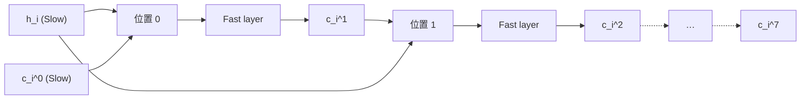

## 前置知识

> [!important]
> 
> 先读：[[2.2 Fast Transformer（声学层）]]、[[3.3 GFSQ 合成方法]]。熟悉多个独立 codebook 的联合分布建模。

---

## 2.2.1.0 定位

> 一句话：Fast Transformer **仅在「codebook 轴」上走 8 步 AR**，不跰越时间轴。本页描述其输入/输出维度与几何计算量。

---

## 2.2.1.1 输入输出维度

设 Slow 输出的隐藏 state $h_i \in \mathbb{R}^d$，在时间 step $i$ 下。Fast 负责生成 codebook $1, 2, \dots, 7$：

$$p\!\left(c_i^{1:7} \mid h_i, c_i^0\right) = \prod_{k=1}^{7} p\!\left(c_i^k \,\big|\, h_i, c_i^{<k}\right)$$

其中 $c_i^k$ 是第 $i$ 帧、第 $k$ 个 codebook 的 token。Slow 提供 $c_i^0$，Fast 从 $k=1$ 起递推。

---

## 2.2.1.2 位置与依赖结构



---

## 2.2.1.3 参数量估计

Fast Transformer 为「轻量双层」设计：

|版本|$d$|层数|参数量|
|---|---|---|---|
|V1.5 0.5B|1024|**2**|~50M|
|S1 1.5B|1536|**2**|~100M|
|S2-Pro 3B|2048|**2**|~180M|

Fast 占总参数不到8%，限制于推理成本。

---

## 2.2.1.4 codebook embedding 共享

> [!important]
> 
> Fast 在所有 codebook 上**共享 embedding 矩阵**，以约束代价。
> 
> 考虑 $V = 1024$（0号 codebook size），$d = 1024$，独立 embedding 需 $7 \times 1024 \times 1024 \approx 7M$ 参数；共享后节省 6×。

---

## 2.2.1.5 推理伪代码

```python
def fast_inference(h_i, c0_i, fast_model):
    """在单个时间 step 上生成 codebook 1–7。"""
    tokens = [c0_i]
    for k in range(1, 8):
        x = embed_codebook(tokens[k-1])
        x = x + h_i                  # 民序 Slow 条件
        out, _ = fast_model(x)       # KV-cache 只在 codebook 轴上存
        logits = fast_head[k](out)   # (V,)
        c_k = sample(logits, top_p=0.9, temp=0.8)
        tokens.append(c_k)
    return tokens                    # (8,) for one frame
```

---

## 2.2.1.6 为什么不合并 codebook 为单 head

> [!important]
> 
> 代选方案：将 8 个 codebook 合并为一个 $V^8 \approx 10^{24}$ 词表。推理时 1 step 完成。问题：
> 
> 1. 词表过大，梯度估计方差高。
> 
> 1. softmax 计算 OOM。
> 
> 1. 训练需指数级数据。
> 
> 因此 Fast Transformer 采用**「8 步小 AR」**是唯一可行路线。

---

## 2.2.1.7 踩坑记录

> [!important]
> 
> **坑 1：Fast 忘渐来 Slow 的** $c_i^0$——造成 codebook 间信息丢失。
> 
> **坑 2：Fast 使用事件 head + KV cache**，cache 仅 7 step，不可与 Slow cache 混淆。
> 
> **坑 3：embedding 共享后 codebook k 需记载 position id**，否则出现 mode collapse。

---

## 参考文献

1. Fish Audio. _Fish-Speech Technical Report_, 2024.

1. Défossez et al. _Encodec_. arXiv 2022.