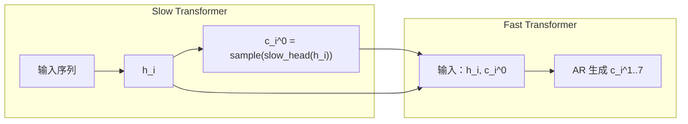

## 前置知识

> [!important]
> 
> 先读：[[2.2.1 Codebook 维度建模]]。熟悉梯度反传与 detach 语义。

---

## 2.2.2.0 定位

> 一句话：Slow 与 Fast 是**串行**架构：Slow 产出 $h_i$ 与 $c_i^0$ 后，Fast 才能开始。本页说明接口的对齐、同步点、梯度处理。

---

## 2.2.2.1 接口形式



---

## 2.2.2.2 串行 vs 并行实现判断

|选项|实现复杂度|训练并行度|推理延迟|
|---|---|---|---|
|严格串行（推理默认）|低|-|**高**|
|训练并行|中|**高**|-|
|推理并行（overlap）|高|-|中|

Fish-Speech 实现采用「训练全并行、推理 step-by-step」。

---

## 2.2.2.3 训练时的全并行诸提拼接

训练时 ground truth $c_i^k$ 已知，Slow 和 Fast 能同时 forward：

- Slow forward 生 $h_{1..L}$ 联同的。

- Fast 输入 $[h_i, c_i^0, c_i^1, \dots, c_i^6]$，并行计算 $c_i^{1..7}$ 的 logits。

这让在 batch dim 上可以拼接为 $(B, L, 8)$ 的张量。

---

## 2.2.2.4 推理时的同步点

```python
def dual_ar_inference(text_ids, prompt_ids):
    slow_kv = init_cache(slow_model)
    for i in range(MAX_LEN):
        # Slow: 1 step
        h_i, slow_kv = slow_model(input_at(i), slow_kv)
        c_i_0 = sample(slow_head(h_i))
        if c_i_0 == EOS:
            break
        # Fast: 在同一个 step 上走 7 个小步
        c_i_rest = fast_inference(h_i, c_i_0, fast_model)
        # 拼接为 8 个 token会合为一帧
        emit_frame([c_i_0] + c_i_rest)
```

---

## 2.2.2.5 梯度反传路径

> [!important]
> 
> 训练时 loss 双路。Fast loss 梯度在 $h_i$ 处与 Slow loss 梯度**叠加**：
> 
> $\nabla_{h_i} \mathcal{L} = \nabla_{h_i} \mathcal{L}_{\text{slow}} + \nabla_{h_i} \mathcal{L}_{\text{fast}}$
> 
> 这使 $h_i$ 同时会被 Slow 任务与 Fast 任务优化，是联合训练的核心。

---

## 2.2.2.6 踩坑记录

> [!important]
> 
> **坑 1：推理时不同步 EOS 检测**：Slow EOS 后需立即停止生成，不要让 Fast 继续走。
> 
> **坑 2：训练时忘 detach h_i.detach()**：Fast loss 梯度必须能传回 Slow，**不要 detach**。
> 
> **坑 3：Fast 报不到「上个帧」**：Fast 仅在 codebook 轴走 7 步，不跨帧，这是设计主意。

---

## 2.2.2.7 与并行 TTS 架构的对比

|架构|codebook 间依赖|推理速度|质量|
|---|---|---|---|
|VALL-E NAR|并行 iterative refine|快|中|
|SoundStream RVQ-AR|严串行|**最慢**|高|
|**Fish-Speech Dual-AR**|串行（8 步小 AR）|**中**|**高**|

---

## 参考文献

1. Fish Audio. _Fish-Speech Technical Report_, 2024.

1. Borsos et al. _AudioLM_. arXiv 2022.