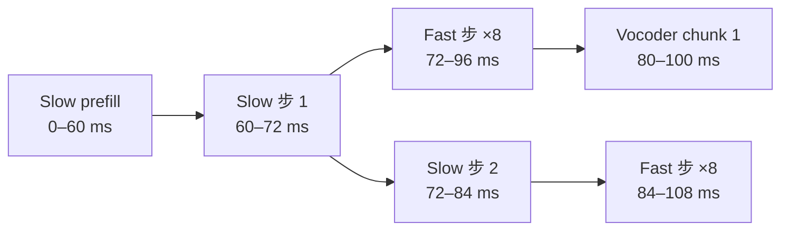

## 前置知识

> [!important]
> 
> 阅读本页前建议先读：[[2.1 Slow Transformer（语义层）]]、[[5.5 GQA 分组查询注意力]]。

---

## 2.4.0 定位

> 一句话：KV-Cache 是 Slow Transformer **达成流式 TTS** 的唯一机制——让每个新 token 的 attention 计算仅以 O(L) 一次访存完成，而不是重复重算所有历史。本页讲清楚它为什么能压住 TTFB，以及哪些变量决定首包延迟。

---

## 2.4.1 KV-Cache 是什么

在 self-attention 中，第 $t$ 个 token 需要与全部 $\le t$ 个 token 的 key/value 做点积：

$$\text{Attn}_t = \text{softmax}\!\left( \frac{q_t [k_1, \dots, k_t]^\top}{\sqrt{d}} \right) [v_1, \dots, v_t]$$

没有 KV-Cache 时，每生成一个新 token 要重计前面所有 token 的 $k_i, v_i$，复杂度 $O(t^2 d)$。

KV-Cache 把 $\{k_i, v_i\}_{i<t}$ 存下来，新 token 仅需计算自己的 $q_t, k_t, v_t$ 并 append，复杂度降为 $O(t d)$。

---

## 2.4.2 TTFB 与 RTF

|指标|含义|Fish-Speech 典型值（RTX 4090）|
|---|---|---|
|**TTFB**（Time-to-First-Byte）|用户发送请求到听到第一个音频字节的延迟|**~150 ms**（1 句中文）|
|**RTF**（Real-Time Factor）|输出音频时长 / 生成耗时|**~0.05**（1 s 音频需 ~50 ms）|

---

## 2.4.3 TTFB 决算式

$$T_{\text{TTFB}} = \underbrace{T_{\text{prefill}}}_{\text{Slow 预填充}} + \underbrace{T_{\text{slow,1}} + 8 T_{\text{fast,1}}}_{\text{首帧生成}} + \underbrace{T_{\text{vocoder,1}}}_{\text{Firefly-GAN 首块}}$$

变量说明：

|变量|含义|4090 典型值|
|---|---|---|
|$T_{\text{prefill}}$|拼接上下文一次性过 Slow|50–80 ms|
|$T_{\text{slow,1}}$|一步 Slow 前向|~12 ms|
|$T_{\text{fast,1}}$|一步 Fast 前向|~3 ms|
|$T_{\text{vocoder,1}}$|Firefly-GAN 解码首 chunk|~20 ms|

代入后：

$$T_{\text{TTFB}} \approx 60 + 12 + 8 \times 3 + 20 = 116 \text{ ms}$$

实际需考虑调度、传输、chunk 拼接，生产环境稳定在 ~150 ms。

---

## 2.4.4 为什么 RTF 低于 0.1

一秒音频需：

- Slow 生成 21 个 token → 21 × 12 = 252 ms（但 prefill 只做一次，后续几乎不吃 prefill）。

- 但 Slow 中间不能坐等——可以与 Fast 重叠，且 Fast + vocoder 在 GPU 空闲上拼接运行。

- 运行时使用按 chunk 丢给 vocoder，隐藏了 vocoder 耗时。

---

## 2.4.5 工程判断与踩坑

> [!important]
> 
> 1. **KV-Cache 显存**：仅 Slow 上下文 8 k token 在 fp16 下约 2 GB（8 layers × 8 KV heads × 8192 seq × 128 head_dim × 2 bytes × 2 KV）。上到 32 k 需 GQA + bf16。
> 
> 1. **chunk size 调优**：chunk 太小（< 5）会让 vocoder kernel 启动开销占主导；chunk 太大（> 30）则会喉咙抱住首包。推荐 8–12。
> 
> 1. **prefix cache**：同一 system + prompt audio 反复调用时，SGLang RadixAttention 可跳过 prefill，TTFB 再降 30%+。详见 [🔬8.1.2 RadixAttention 与前缀缓存](https://www.notion.so/8-1-2-RadixAttention-7308e47799bb49e191e62ec8b7dba248?pvs=21)。

---

## 下沉 L4 子页

[[2.4.1 KV-Cache 数学原理]]

[[2.4.2 TTFB 与 RTF 指标定义]]

---

## 延伸阅读

- [[8.1 SGLang-Omni Serving]]

- [[5.5 GQA 分组查询注意力]]

---

## 参考文献

1. Pope et al. _Efficiently Scaling Transformer Inference_. arXiv:2211.05102, 2022.

1. Kwon et al. _Efficient Memory Management for Large Language Model Serving with PagedAttention_. SOSP 2023.

1. Fish-Speech 源码 `fish_speech/inference/kv_cache.py`。