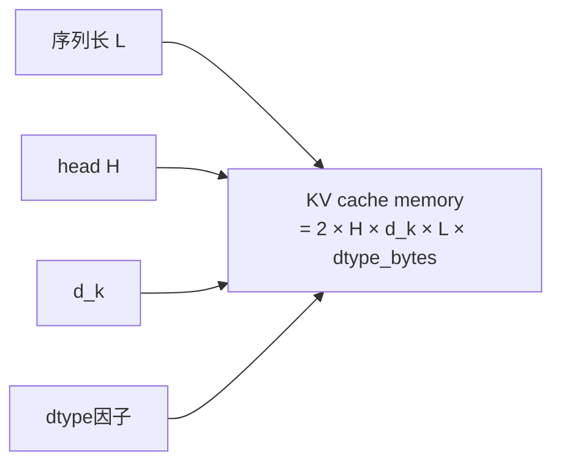

## 前置知识

> [!important]
> 
> 先读：[[2.4 KV-Cache 与首包延迟]]、[[5.5 GQA 分组查询注意力]]。熟悉 Self-Attention 计算。

---

## 2.4.1.0 定位

> 一句话：KV-Cache 是「复用历史计算」的记忆体，将 Self-Attention 的推理复杂度从 $O(L^2)$ 降到 $O(L)$ per step。

---

## 2.4.1.1 为什么 AR 推理需 KV-Cache

在 AR 推理中，每生成一个 token要重新 attention。如果不缓存：

$$\text{Computations}(L) = \sum_{i=1}^{L} O(i \cdot d^2) = O(L^2 d^2)$$

缓存 $K, V$ 后，每 step 仅需计算新 token 与 cache 的 attention：

$$\text{Computations}(L) = \sum_{i=1}^{L} O(i \cdot d^2) \to \sum_{i=1}^{L} O(d^2 + i \cdot d_k) = O(L \cdot d^2)$$

节省 $L$ 倍计算。

---

## 2.4.1.2 公式推导

设在 step $L$ 生成，查询需计算 attention：

$$\text{Attn}_L = \text{softmax}\!\left(\frac{q_L K^\top}{\sqrt{d_k}}\right) V$$

其中 $K, V \in \mathbb{R}^{L \times d_k}$ 是所有过去 step 的 K/V。记住 $K, V$ 后，下一步仅需计算 $k_{L+1}, v_{L+1}$ 并拼接：

$$K^{new} = [K; k_{L+1}], \quad V^{new} = [V; v_{L+1}]$$

---

## 2.4.1.3 内存估计



以 Fish-Speech S1 0.5B Slow Transformer 为例：$H = 16, d_k = 64, L = 8192$，dtype = fp16。

单层 KV cache：$2 \cdot 16 \cdot 64 \cdot 8192 \cdot 2 = 32\text{ MB}$。

24 层：**768 MB**。

---

## 2.4.1.4 GQA 后的压缩

采用 GQA 以 $G = 4$：$32 \text{ MB} \times \frac{4}{16} = 8\text{ MB} / \text{层}$。

24 层：**192 MB**，节省 576 MB 显存。

---

## 2.4.1.5 PyTorch 实现

```python
class KVCache:
    def __init__(self, max_len, n_heads, d_k, dtype=torch.float16):
        self.k = torch.zeros((max_len, n_heads, d_k), dtype=dtype, device='cuda')
        self.v = torch.zeros((max_len, n_heads, d_k), dtype=dtype, device='cuda')
        self.pos = 0
    
    def append(self, k_new, v_new):
        """k_new, v_new shape: (1, n_heads, d_k)"""
        self.k[self.pos] = k_new
        self.v[self.pos] = v_new
        self.pos += 1
    
    def get(self):
        return self.k[:self.pos], self.v[:self.pos]

def attention_with_cache(q, kv_cache):
    k, v = kv_cache.get()
    scores = q @ k.transpose(-2, -1) / math.sqrt(d_k)
    attn = scores.softmax(dim=-1)
    return attn @ v
```

---

## 2.4.1.6 Slow + Fast 双 cache

> [!important]
> 
> Fish-Speech 推理需维护两份 cache：
> 
> 1. **Slow KV cache**：上下文长度 = 文本 + prompt audio + 已生成 audio token。
> 
> 1. **Fast KV cache**：长度仅 7（codebook 轴），**每帧重置**。
> 
> 这让 Fast cache 可预分配为固定大小。

---

## 2.4.1.7 踩坑记录

> [!important]
> 
> **坑 1：RoPE 加位置后存入 cache，不要存原始 K**。否则每 step 要重新 apply RoPE。
> 
> **坑 2：fp16 cache 下长序列会出现累积误差**，需 bf16 或 fp32 cache。
> 
> **坑 3：pre-allocated cache 默认 0 初始化**，softmax 最初会 attend 到 padding 位置，需 attention mask。

---

## 参考文献

1. Pope et al. _Efficiently Scaling Transformer Inference_. MLSys 2023.

1. vLLM paper. _PagedAttention_. SOSP 2023.