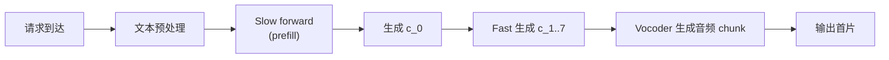

## 前置知识

> [!important]
> 
> 先读：[[2.4 KV-Cache 与首包延迟]]。熟悉推理供服指标（延迟、吞吐）。

---

## 2.4.2.0 定位

> 一句话：TTS 供服上两个最重要的推理指标：**TTFB（Time To First Byte）** 与 **RTF（Real-Time Factor）**。本页给出严格定义、测量方法与 Fish-Speech 的实际表现。

---

## 2.4.2.1 指标定义

|指标|定义|公式|目标值|
|---|---|---|---|
|**TTFB**|从请求到接收第一个 audio 输出的时间|$t_{first} - t_{request}$|< 500 ms|
|**RTF**|生成一秒音频需多少秒|$\frac{\text{wall time}}{\text{audio duration}}$|< 1.0（实时）|
|Throughput|单位时间生成的音频总时长|$\frac{\sum d_j}{\Delta t}$|越高越好|
|p95 latency|95% 请求的 TTFB 在此值以下|quantile(TTFB, 0.95)|< 1s|

---

## 2.4.2.2 TTFB 拆解

其中 **Slow prefill** 是 TTFB 的最大贡献项。

---

## 2.4.2.3 Fish-Speech 实测数据

|版本|硬件|TTFB|RTF|备注|
|---|---|---|---|---|
|V1.5 0.5B|RTX 4090|~250 ms|~0.15|chunk=20|
|S1 1.5B|RTX 4090|~400 ms|~0.25|chunk=20|
|S2-Pro 3B|A100 40GB|~350 ms|~0.18|chunk=40|
|S2-Pro 3B|RTX 4090|~600 ms|~0.35|chunk=40|

---

## 2.4.2.4 Streaming chunk 与 TTFB 的 trade-off

> [!important]
> 
> - chunk 太小（6–8）→ **TTFB 低**但 **RTF 高** （vocoder 调用频繁）。
> 
> - chunk 太大（40+）→ **RTF 低**但 **TTFB 高**。
> 
> Fish-Speech 默认 chunk = 20，是经验甜点。

---

## 2.4.2.5 优化 TTFB 的 5 个技术

> [!important]
> 
> 1. **打低 prefill 量**：不要在 prompt audio 中拼入超过 10s 的参考。
> 
> 1. **Compile Slow model**：torch.compile 可减少 30% 延迟。
> 
> 1. **Flash-Attention 2**：prefill 阶段加速 1.5×。
> 
> 1. **量化到 INT8**：Slow Transformer 量化后 TTFB 减 20%。
> 
> 1. **Vocoder 预热**：首次调用不计在 TTFB（采用 warm pool）。

---

## 2.4.2.6 优化 RTF 的 5 个技术

> [!important]
> 
> 1. **推理 chunk size = 40**：vocoder 调用频率减半。
> 
> 1. **Continuous batching**（vLLM 风）：多请求复用 GPU。
> 
> 1. **GFSQ 低 token rate 选择**：25 Hz vs 50 Hz，decoder 计算减半。
> 
> 1. **HiFi-GAN vocoder 量化**：FP16/INT8。
> 
> 1. **CUDA Graph**：Fast 推理头部接 graph capture。

---

## 2.4.2.7 踩坑记录

> [!important]
> 
> **坑 1：测 TTFB 未含请求排队时间**，需从请求 enqueue 开始计，不是 model 调用开始。
> 
> **坑 2：RTF 未含 vocoder**，需含从 token 到 audio 的每个环节。
> 
> **坑 3：p50 不能代表业务**，需看 p95/p99。

---

## 参考文献

1. NVIDIA. _Best Practices for Triton Inference Server Benchmarking_.

1. vLLM team. _Continuous Batching_. blog 2023.