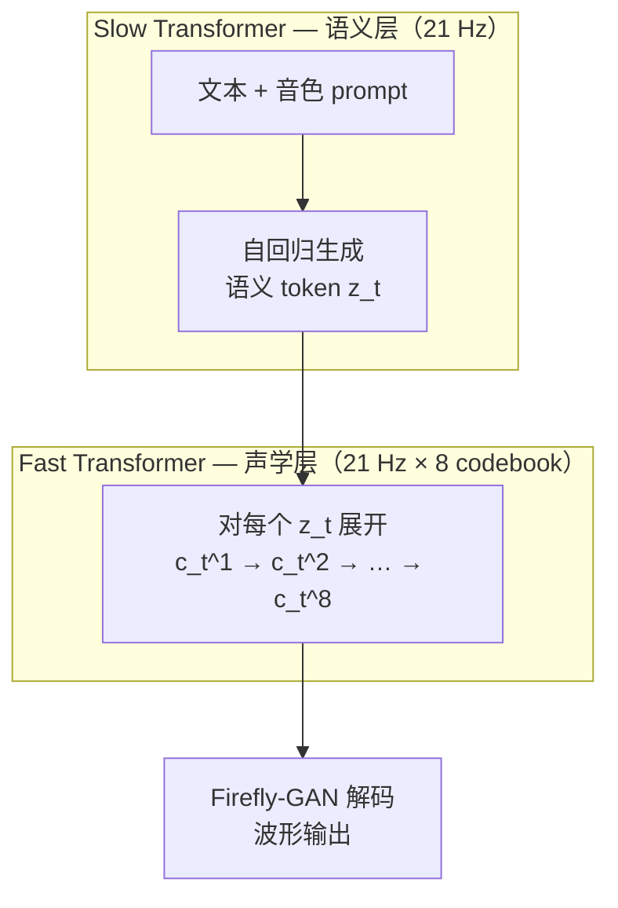

## 前置知识

> [!important]
> 
> 阅读本章前建议先读：[[3. 语音 Tokenizer：GFSQ]]（理解 token 长什么样）、[[5. LLM Backbone（Llama-3 风格）]]（理解每个 Transformer 块的细节）。

---

## 2.0 定位

> 一句话：Dual-AR（**双自回归**）是 Fish-Speech V1.5 起的**主干架构**——它把语音生成拆成「先想说什么（语义）」与「再决定怎么说（声学）」两个串行的自回归 Transformer，是该系列**所有低延迟与高质量能力的根因**。

---

## 2.1 为什么需要两个 AR？

传统神经 codec TTS（如 VALL-E、SpeechGPT）使用**单 AR + 多 codebook 平铺**的方式：把每帧 8 个 codebook 拼成一个长 token 序列，再用单 AR 自回归。这在 75 Hz × 8 = 600 token/s 的速率下，模型生成 1 秒音频要做 600 次前向——延迟与吞吐都吃不消。

Dual-AR 的核心洞察：

> **语义信息（说什么）变化频率低，声学细节（怎么说）变化频率高。把两者解耦，让 Slow 在低频运行，Fast 在高频运行但「窗口小」。**

---

## 2.2 同级架构对比

|架构|代表模型|AR 数量|有效 token rate|TTFB（4090, 1 句）|痛点|
|---|---|---|---|---|---|
|**单 AR 平铺**|VALL-E|1|600 token/s|~800 ms|延迟高、吞吐低|
|**单 AR + NAR**|VALL-E NAR|1 AR + 1 NAR|75 token/s（AR 层）|~300 ms|NAR 易音色漂移|
|**Dual-AR**|Fish-Speech V1.5+|2 AR|21 token/s（Slow）+ 8 step Fast/帧|**~150 ms**|训练流程复杂|
|**Diffusion**|NaturalSpeech 3|—|—|~1 s+（非流式）|难以流式|

> [!important]
> 
> **为什么 Dual-AR 比 AR+NAR 更稳？** NAR 一次性预测所有 codebook，对噪声敏感且常出现音色漂移；Fast Transformer 仍是 AR，但每帧只跑 8 步，既保留稳定性又压住延迟。

---

## 2.3 三大核心收益

1. **低首包延迟**：Slow 只跑 21 Hz，每秒只需 21 次大模型前向；Fast 跑 8×21=168 次小模型前向，但参数量远小于 Slow（典型 ~150 M vs ~500 M）。

1. **流式友好**：Slow 输出一个语义 token，Fast 立即可以解码出 ~48 ms 音频；配合 KV-Cache 可以做边生成边播。

1. **音色与内容解耦**：音色 prompt 只注入 Slow 的输入端，Fast 只看 Slow 输出，避免了 prompt 直接污染声学细节。

---

## 2.4 工程判断：什么时候不该用 Dual-AR？

> [!important]
> 
> **优先级链**：流式 TTS / 长文本 → Dual-AR；离线短句高保真 → 可以考虑 Diffusion；研究单一 codebook 设计 → 单 AR 更简洁。

---

## 2.5 常见误区

> [!important]
> 
> **误区 1**：「Fast 是 NAR」——错。Fast 仍是 AR，只是序列长度固定为 codebook 数（8）。
> 
> **误区 2**：「两个 AR 共享参数」——错。Slow 和 Fast 是独立权重，Slow 大、Fast 小。
> 
> **误区 3**：「Dual-AR 必须配 GFSQ」——架构上独立，但 GFSQ 的低 token rate 是 Dual-AR 收益的关键放大器。

---

## 2.6 子页面导航

[[2.1 Slow Transformer（语义层）]]

[[2.2 Fast Transformer（声学层）]]

[[2.3 输入序列拼接格式]]

[[2.4 KV-Cache 与首包延迟]]

---

## 参考文献

1. Fish Audio. _Fish-Speech Technical Report_, 2024.

1. Wang et al. _VALL-E: Neural Codec Language Models are Zero-Shot Text to Speech Synthesizers_. arXiv:2301.02111, 2023.

1. Fish-Speech 源码：`fish_speech/models/text2semantic/llama.py`、`fast.py`。