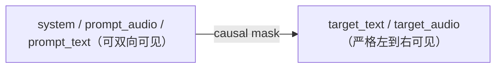

## 前置知识

> [!important]
> 
> 阅读本页前建议先读：[[2.1 Slow Transformer（语义层）]]、[6.5 文本分词](https://www.notion.so/441fc84b606f458cb97a1f7ca0a575d5）**)。

---

## 2.3.0 定位

> 一句话：本页详解 Slow Transformer 的输入序列是怎么拼接出来的——这决定了音色 prompt 、控制标签、说话人切换是如何**以同一个 token 空间**传递给模型的。

---

## 2.3.1 拼接模板

Fish-Speech V1.5 / S1 使用的拼接模板（伪代码）：

```jsx
<|begin_of_sequence|>
<|im_start|>system
You are a TTS assistant.
<|im_end|>
<|im_start|>user
<|prompt_audio|> [音色参考音频 GFSQ token]
<|prompt_text|> [参考音频对应文本]
<|im_end|>
<|im_start|>assistant
<|target_text|> [要合成的文本]
<|target_audio|> [生成的 GFSQ token]
<|im_end|>
<|end_of_sequence|>
```

S2 加入控制标签后，`target_text` 中可含 `(laugh)`、`[speaker1]` 等。

---

## 2.3.2 为什么这么设计

|设计元素|作用|不这么做的后果|
|---|---|---|
|`<\|im_start\|>` / `<\|im_end\|>`|复用 Llama-3 chat 模板|无法直接接 Llama-3.2 预训练权重|
|prompt_audio 在 prompt_text 之前|训练中加强「看到音色再读文」顺序|顺序反过来会出现 prompt audio 变 attention sink|
|target_text + target_audio 同存|让模型学「文-音对齐」在 attention 的隐式表示|只给 target_text 会让 Slow 谜猜节奏|
|`<\|target_audio\|>` 分隔符|告诉模型「从这里开始产出 GFSQ token」|不加会出现路径混淆，文本生成成主导|

---

## 2.3.3 多说话人场景（S2）

```jsx
<|target_text|>
[speaker1] Where are you going?
[speaker2] To the airport, (sigh) flight at 3.
[speaker1] (laugh) Need a ride?
```

两个 `[speaker]` 标签背后是不同的 prompt audio，都被拼在同一个 `<|im_start|>user` 块里。Slow 需要学会「看到 [speakerX] 则切换到对应 prompt audio 表示」。

---

## 2.3.4 attention 掩码与可见性



Fish-Speech 使用**纯因果 attention**，prompt 部分对后面所有 token 可见，但 target 部分严格遵从左到右。这与 Llama-3 推理须一致，以复用 FlashAttention kernel。

---

## 2.3.5 工程判断与踩坑

> [!important]
> 
> 1. **特殊 token 不要跳出词表**：Llama-3.2 BPE 留了几个 `<|reserved_X|>` slot，Fish-Speech 复用这些位置为 `<|prompt_audio|>` 等，避免扩词表。
> 
> 1. **prompt audio 长度控制**：推荐 3–7 s，超过 10 s 容易让 Slow 「复诵」 prompt 语义。
> 
> 1. **多说话人 prompt audio 拼接顺序**：与 [speakerX] 出现顺序保持一致，乱序会造成音色错位。

---

## 2.3.6 常见误区

> [!important]
> 
> **误区 1**：「不需要 prompt_text」——不加会让 Slow 以 GFSQ 隐式推文本，加在多语种上准确率提高 5%+。
> 
> **误区 2**：「prompt audio 越长越好」——超过 10 s 逆收益明显。

---

## 延伸阅读

- [[9.1 自然语言情感标签（NL Tags）]]

- [6.5 文本分词](https://www.notion.so/441fc84b606f458cb97a1f7ca0a575d5）**)

---

## 参考文献

1. Fish-Speech 源码 `fish_speech/conversation.py`。

1. Llama-3 chat template。