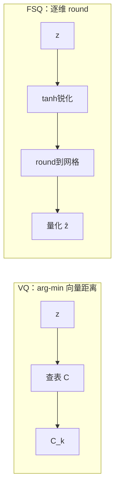

## 前置知识

> [!important]
> 
> 先读：[[3.1 FSQ 原理]]、[[3.2 GVQ（Grouped Vector Quantization）]]。熟悉量化、卷积、VAE。

---

## 3.1.1.0 定位

> 一句话：本页从原理上对比 **VQ（Vector Quantization）** 与 **SQ/FSQ（Scalar / Finite Scalar Quantization）**，说明 Fish-Speech 为何最终选择 FSQ 作为基础。

---

## 3.1.1.1 二者本质区别

|项目|VQ（向量量化）|**SQ / FSQ（标量量化）**|
|---|---|---|
|量化对象|整个向量 $z \in \mathbb{R}^d$|**每个分量** $z_i \in \mathbb{R}$|
|codebook|显式 $C \in \mathbb{R}^{K \times d}$|**隐式**：以 $L^d$ 隔点网格表达|
|codebook 参数|$K \cdot d$|**0（无参数）**|
|量化过程|arg-min $\\|z - C_k\\|$|**逐维 round**|
|collapse 风险|**高**|**低**|
|code 利用率|低（常始不足 30%）|**高（>90%）**|

---

## 3.1.1.2 VQ 公式回顾

VQ-VAE（van den Oord 2017）：

$$q(z) = \arg\min_{k \in [K]} \|z - C_k\|_2$$

loss：

$$\mathcal{L} = \|x - \hat{x}\|^2 + \|\text{sg}[z] - C_q\|^2 + \beta \|z - \text{sg}[C_q]\|^2$$

其中 sg 是 stop-gradient。**问题**：arg-min 不可导，需 STE；codebook 更新需额外 EMA 或 commitment loss；codebook 训练难。

---

## 3.1.1.3 FSQ 公式

Mentzer et al. (ICLR 2024) 提出 FSQ，对每个分量 $z_i \in \mathbb{R}$，先限制到 $[-1, 1]$，再映射到 $L_i$ 个离散点：

$$\hat{z}_i = \frac{\text{round}\left(\frac{L_i - 1}{2} \cdot \tanh(z_i)\right)}{(L_i - 1)/2}$$

设计为 $\hat{z}_i \in \{-1, -\frac{L_i-3}{L_i-1}, \dots, \frac{L_i-3}{L_i-1}, 1\}$，共 $L_i$ 个点。

总 code 数：$\prod_i L_i$，例如 $L = (8, 5, 5, 5)$ → $K = 1000$。

---

## 3.1.1.4 几何直观对比

---

## 3.1.1.5 参数量对比实例

> [!important]
> 
> 假设需 K = 1024 个 code，d = 512。
> 
> - **VQ**：codebook 参数 = 1024 × 512 = **524k**
> 
> - **FSQ**：L = (8, 5, 5, 5, 5)，参数 = **0**
> 
> FSQ 独立于主模型并计算量低。

---

## 3.1.1.6 为什么 Fish-Speech 选 FSQ 不选 VQ

> [!important]
> 
> 1. **避免 collapse**：VQ 在 TTS 上常出现 30%+ codebook 不使用。
> 
> 1. **训练稳**：不需 EMA 调参。
> 
> 1. **多码本叠加容易**：GFSQ 是在 FSQ 上加 group。
> 
> 1. **推理轻**：量化仅 round，不需全表查询。

---

## 3.1.1.7 踩坑记录

> [!important]
> 
> **坑 1：FSQ 未加 tanh 直接 round** → 梯度在边界点发散。
> 
> **坑 2：FSQ 的 L 选偏大** → latent 表达不充分。经验值： $L \in [4, 8]$ 。
> 
> **坑 3：误认 FSQ = sign 函数**，sign 是 $L=2$ 的特例， FSQ 一般 $L \geq 3$。

---

## 参考文献

1. van den Oord et al. _Neural Discrete Representation Learning_. NeurIPS 2017.

1. Mentzer et al. _Finite Scalar Quantization: VQ-VAE Made Simple_. ICLR 2024.