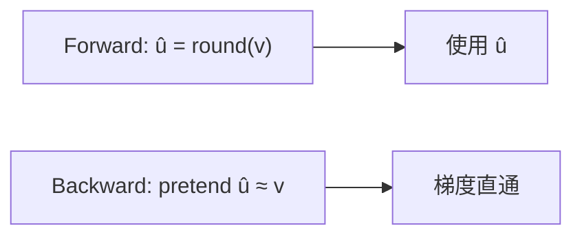

## 前置知识

> [!important]
> 
> 先读：[[3.1.1 标量量化 vs 向量量化]]。熟悉反向传播与不可导函数的梯度估计。

---

## 3.1.2.0 定位

> 一句话：本页完整推导 FSQ 的 forward 与 backward，说明「梯度直通估计」（Straight-Through Estimator，STE）如何让不可导的 round 可训练。

---

## 3.1.2.1 FSQ Forward 公式

设单个分量 $z \in \mathbb{R}$，量化级别 $L$。定义：

$$u = \tanh(z) \in (-1, 1)$$

$$v = \frac{L - 1}{2} \cdot u$$

$$\hat{v} = \text{round}(v)$$

$$\hat{z} = \frac{\hat{v}}{(L-1)/2}$$

$\hat{z}$ 取 $L$ 个离散值。

---

## 3.1.2.2 round 的梯度问题

$$\frac{\partial \text{round}(v)}{\partial v} = 0 \quad \text{almost everywhere}$$

梯度始终为 0 意味着反向传播时**信号无法传过量化点**，上游网络不能被优化。

---

## 3.1.2.3 STE：梯度直通估计



STE 的核心思想：

$$\hat{v}_{\text{ste}} = v + \text{sg}(\text{round}(v) - v)$$

其中 sg 为 stop-gradient。

Forward： $\hat{v}_{\text{ste}} = \text{round}(v)$ （sg 不影响值）。

Backward： $\frac{\partial \hat{v}_{\text{ste}}}{\partial v} = 1$ （仅 v 项贡献梯度）。

---

## 3.1.2.4 PyTorch 实现

```python
import torch

def fsq_quantize(z: torch.Tensor, L: int = 5) -> torch.Tensor:
    """FSQ 量化，STE 梯度直通。
    Args:
        z: shape (..., d) latent
        L: 每个分量的量化级别
    Returns:
        量化后的 latent (..., d)
    """
    u = torch.tanh(z)
    v = u * (L - 1) / 2
    v_round = torch.round(v)
    # STE：forward = round，backward 梯度 ≈ v
    v_ste = v + (v_round - v).detach()
    z_hat = v_ste / ((L - 1) / 2)
    return z_hat
```

---

## 3.1.2.5 STE 为什么能起作用

> [!important]
> 
> 严格说，STE 是一个**偏梯度估计器**，在量化点附近误差小。以下三个原因使其表现好：
> 
> 1. **绿色梯度**：反传信号仍与原始优化目标同方向。
> 
> 1. **平均误差低**：round 误差上限 0.5，偏平均为 0。
> 
> 1. **学习面广**：z 趋近量化点时 STE 误差趋于 0。

---

## 3.1.2.6 与 VQ-STE 的区别

|项目|VQ-STE|**FSQ-STE**|
|---|---|---|
|forward|$\hat{z} = C_k$，argmin 查表|$\hat{z}$ = round 后量化|
|backward|梯度 = 1 传回 z|梯度 = 1 传回 z|
|commitment loss|**需**（$\\|z - C_q\\|^2$）|**不需**|
|codebook 更新|EMA 或梯度|**无 codebook**|

---

## 3.1.2.7 踩坑记录

> [!important]
> 
> **坑 1：forget .detach()** → round 梯度会被 autograd 处理为 0，梯度全部断。
> 
> **坑 2：tanh 在 z 过大时饱和** → 梯度消失。需限制 z 范围或采用 LayerNorm。
> 
> **坑 3：fp16 下 round 输出、 STE 计算 lost precision** → cast 到 fp32。

---

## 参考文献

1. Bengio et al. _Estimating or Propagating Gradients Through Stochastic Neurons for Conditional Computation_. arXiv 2013.

1. Mentzer et al. _FSQ_. ICLR 2024.