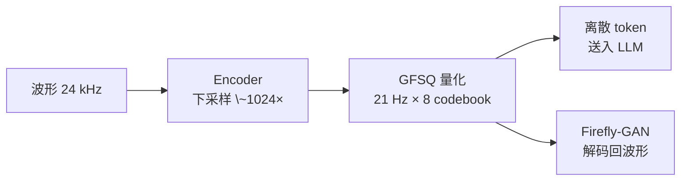

## 前置知识

> [!important]
> 
> 阅读本章前建议先读：[[2. 核心架构：Dual-AR（双自回归）]]（理解 token 在生成流程中的位置）、[[4. 声码器：Firefly-GAN（FFGAN）]]（理解 token 解码端）。

---

## 3.0 定位

> 一句话：**GFSQ（Grouped Finite-Scalar Quantization，分组有限标量量化）** 是 Fish-Speech 系列从 V1.5 开始使用的语音 tokenizer——它把连续波形压缩成离散 token，决定了 Dual-AR LLM 看到的「字母表」长什么样。GFSQ 同时把 token rate（每秒 token 数）压到 21 Hz × 8 codebook，远低于同类方案，是低延迟流式 TTS 的另一根支柱。

---

## 3.1 为什么需要语音 tokenizer

LLM 只会处理离散 token，而音频是连续信号。语音 tokenizer 的任务是：

1. 把音频压成 LLM 能读的离散序列。

1. 保证这个序列**可解码回波形**（与 Firefly-GAN 配对）。

1. token rate 要尽可能低（影响 AR 延迟）但保留足够语义/声学信息。

---

## 3.2 同级方案对比

|Tokenizer|方法|有效 codebook 数|token rate|痛点|
|---|---|---|---|---|
|EnCodec|RVQ（残差矢量量化）|8|75 Hz × 8 = 600 token/s|RVQ 训练困难、码本坍塌|
|SoundStream|RVQ|4–8|50 Hz × 8 = 400 token/s|同 EnCodec|
|DAC|RVQ + 改进|9|86 Hz × 9 ≈ 774 token/s|token 量大，AR 慢|
|FSQ|有限标量量化|1（高维度）|~50 Hz|单 codebook 容量上限低|
|**GFSQ**|**FSQ 分组**|**8 组 × FSQ**|**21 Hz × 8 = 168 token/s**|需要精细分组设计|

> [!important]
> 
> GFSQ 的核心创新：**把 FSQ「单 codebook 容量低」的劣势用分组扩展容量，同时保留 FSQ「无 EMA 无码本坍塌」的训练稳定性**——既能拿到 RVQ 的表达力，又免去了 RVQ 的训练痛点，还把 token rate 压到 1/3。

---

## 3.3 GFSQ 的三个关键设计

1. **FSQ 基础**：用「投影到固定整数格点」代替学习 codebook，无需 EMA、不会坍塌。详见 [[3.1 FSQ 原理]]。

1. **分组扩展容量**：把 FSQ 输出空间切成 G 组，每组独立量化，总容量 = $\prod_g L_g$，但每组独立训练。详见 [[3.2 GVQ（Grouped Vector Quantization）]]。

1. **极低 token rate**：21 Hz 是经过 ablation 选定的最小满足语义完整性的值，详见 [[3.5 21Hz - 42Hz Token Rate 选型]]。

---

## 3.4 工程判断：什么时候选 GFSQ

> [!important]
> 
> **优先级链**：流式 TTS、低 token rate 需求 → GFSQ；研究高保真音频压缩（音乐、ASR codec） → 仍可考虑 DAC/EnCodec；超低 bitrate（< 1 kbps） → 仍属研究前沿。

---

## 3.5 常见误区

> [!important]
> 
> **误区 1**：「GFSQ 就是多 codebook FSQ」——错。GFSQ 还包含 encoder downsample、分组维度切分、与 Firefly-GAN 联合训练等多项细节。
> 
> **误区 2**：「token rate 越低越好」——错。21 Hz 以下会出现音素跳脱与发音模糊，详见 3.5。
> 
> **误区 3**：「GFSQ 等价 RVQ」——错。GFSQ 是 FSQ 分组（无残差递归），RVQ 是矢量量化的残差递归，两者训练范式根本不同。详见 [[3.4 与 RVQ - EnCodec - VQ-VAE 对比]]。

---

## 3.6 子页面导航

[[3.1 FSQ 原理]]

[[3.2 GVQ（Grouped Vector Quantization）]]

[[3.3 GFSQ 合成方法]]

[[3.4 与 RVQ - EnCodec - VQ-VAE 对比]]

[[3.5 21Hz - 42Hz Token Rate 选型]]

---

## 参考文献

1. Mentzer et al. _Finite Scalar Quantization: VQ-VAE Made Simple_. ICLR 2024.

1. Défossez et al. _High Fidelity Neural Audio Compression_. TMLR 2023 (EnCodec).

1. Fish-Speech 源码 `fish_speech/models/vqgan/modules/fsq.py`。