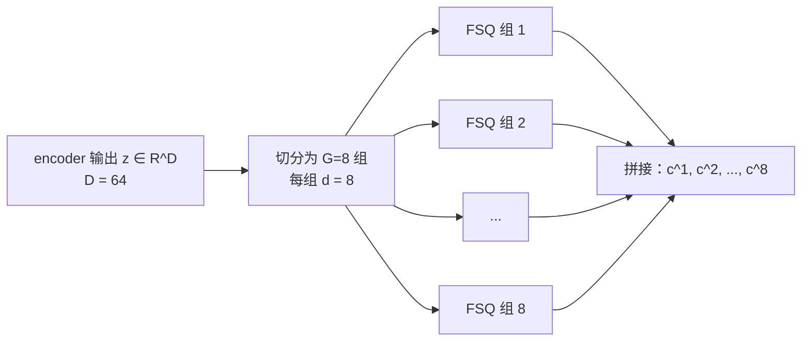

## 前置知识

> [!important]
> 
> 阅读本页前建议先读：[[3.1 FSQ 原理]]。

---

## 3.2.0 定位

> 一句话：GVQ（**Grouped Vector Quantization，分组矢量量化**）是把一个高维量化问题拆成**G 个独立的低维量化问题**。它与 RVQ（残差）、PQ（乘积）同属「合成大 codebook」的三种经典路线，是 GFSQ 能取得超高表达力的结构基础。

---

## 3.2.1 为什么需要分组

FSQ 单个 codebook 的容量 $\prod_d L_d$ 随 $D$ 指数增长，但也带来三个问题：

1. **表达压缩**：LLM 需要预测单个多类 token，词表太大会让 softmax 头变量大且难训练。

1. **信息解耦**：希望不同 codebook 承担不同语言学角色（语义 / 韵律 / 音色）。

1. **与 Dual-AR 携手**：Slow 仅需预测「语义主轴」那一 codebook，剩下交给 Fast。

---

## 3.2.2 三种“拆大 codebook”的策略

|策略|拆分方式|训练|代表应用|适合场景|
|---|---|---|---|---|
|**GVQ（分组）**|维度切块，独立量化|互不干扰，可并行|**Fish-Speech GFSQ**|信息角色需要解耦|
|**RVQ（残差）**|残差递归量化|递归训练，依赖前一层|EnCodec / DAC|高保真音频压缩|
|**PQ（乘积）**|维度切块，独立 VQ|同 GVQ（但是 VQ）|FAISS 检索|向量检索、ANN|

> [!important]
> 
> **GVQ vs PQ**：二者在“维度切块独立量化”的走法上一致，但 PQ 调用 VQ（需学习 codebook），GVQ 在本文语境下默认调用 FSQ（整数格点）。他们不是「同一词」，只是思路同源。

---

## 3.2.3 GVQ 量化公式

设 encoder 输出 $z \in \mathbb{R}^D$，划为 $G$ 组，每组维度 $d = D/G$：

$$z = [z^{(1)}, z^{(2)}, \dots, z^{(G)}], \quad z^{(g)} \in \mathbb{R}^d$$

每组独立 FSQ：

$$\hat{z}^{(g)} = \text{FSQ}_g(z^{(g)}), \quad c^g = \text{index}(\hat{z}^{(g)})$$

输出拼接回原空间：

$$\hat{z} = [\hat{z}^{(1)}, \dots, \hat{z}^{(G)}], \quad c = (c^1, \dots, c^G)$$

---

## 3.2.4 各组会「自发」承担不同角色吗？

严格说不会，但结合训练目标与使用方式会出现隐式分化：

1. Slow Transformer 只预测 $c^1$，代价由 cross-entropy 回传。为了让 $c^1$ 可预测，它会退化为「富语义、低频」信息。

1. Fast Transformer 依次预测 $c^2, \dots, c^8$，后面的组出现「高频细节」信息（音色颜色、鼻音等）。

1. 联合与 Firefly-GAN 的重建 loss 约束，保证总体表达力。

> [!important]
> 
> 这是「训练目标隐式引导表示分化」的经典例子：架构上 $c^1$ 与 $c^2$ 对称，但预测顺序与代价不同，造成不同粒度的信息分布。

---

## 3.2.5 工程判断与踩坑

> [!important]
> 
> 1. **维度平均切分**：Fish-Speech 将 $D=64$ 平分为 8×8。不平均切分会造成某些组表达力远超剩余组，劣化 Fast 训练。
> 
> 1. **组间纯独立**：不要在组间加 cross-attention；一旦组间耦合，Fast 的 AR 依靠的「只看前 k-1 个」设计会崩。

---

## 延伸阅读

- [[3.3 GFSQ 合成方法]]

- [[3.4 与 RVQ - EnCodec - VQ-VAE 对比]]

---

## 参考文献

1. Mentzer et al. _Finite Scalar Quantization: VQ-VAE Made Simple_. ICLR 2024.

1. Jegou et al. _Product Quantization for Nearest Neighbor Search_. TPAMI 2011.

1. Fish-Speech 源码 `fish_speech/models/vqgan/modules/grouped_fsq.py`。