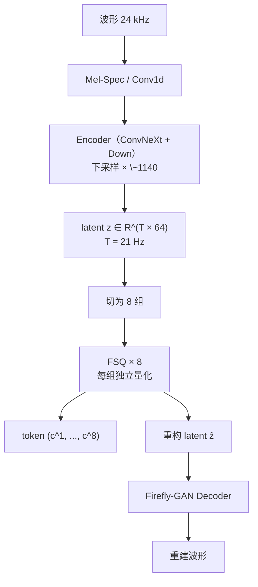
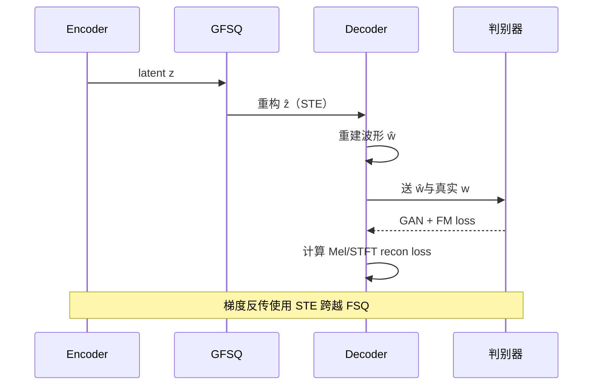

## 前置知识

> [!important]
> 
> 阅读本页前建议先读：[[3.1 FSQ 原理]]、[[3.2 GVQ（Grouped Vector Quantization）]]。

---

## 3.3.0 定位

> 一句话：**GFSQ = encoder + downsample + GVQ(FSQ) + Firefly-GAN 联合训练**。本页讲清楚从波形到 token 的全流程与训练目标。

---

## 3.3.1 完整管道



---

## 3.3.2 关键参数

|项目|S1 配置|
|---|---|
|采样率|24 kHz|
|encoder downsample|总×1140 → 21 Hz|
|latent 维度 D|64|
|分组数 G|8|
|每组维度 d|8|
|FSQ 级数 $L$|[8, 5, 5, 5, 5, 5, 5, 5]|
|每组有效 codebook|$8 \times 5^7 \approx 6.25\text{e}5$|
|token rate|21 Hz × 8 = 168 token/s|
|等效比特率|~1.68 kbps|

---

## 3.3.3 训练目标

联合损失函数：

$$\mathcal{L} = \underbrace{\mathcal{L}_{\text{recon}}}_{\text{Mel + STFT}} + \lambda_{\text{adv}} \underbrace{\mathcal{L}_{\text{GAN}}}_{\text{HiFi-GAN 判别器}} + \lambda_{\text{fm}} \underbrace{\mathcal{L}_{\text{fm}}}_{\text{feature matching}}$$

FSQ 本身不贡献 loss，仅依靠 STE 传梯度。

常用权重：$\lambda_{\text{adv}} = 1.0, \lambda_{\text{fm}} = 2.0$。详见 [[4.4 判别器与损失函数]]。

---

## 3.3.4 训练调度



---

## 3.3.5 推理路径

```python
# 编码 (audio → token)
z = encoder(waveform)             # (B, T, 64)
z_q, indices = grouped_fsq(z)     # indices: (B, T, 8)
# Slow / Fast LLM 看到的是 indices

# 解码 (token → audio)
z_q = grouped_fsq.unembed(indices)
waveform = decoder(z_q)
```

---

## 3.3.6 工程判断与踩坑

> [!important]
> 
> 1. **encoder 不能过深**：ConvNeXt 超过 16 块后增益小、训练虚耗高。
> 
> 1. **FSQ 与判别器调度**：初期 5 k step 只训 encoder + decoder + recon loss，之后才引入判别器，避免 FSQ 未收敛时被判别器错误的负反馈加速坍塌。
> 
> 1. **bf16 训练**：FSQ 里的取整在 fp16 上会出现「临界振荡」，bf16 更稳定。

---

## 延伸阅读

- [[3.4 与 RVQ - EnCodec - VQ-VAE 对比]]

- [[4.5 firefly-gan-vq-fsq-8x1024-21hz 权重解读]]

---

## 参考文献

1. Fish-Speech 源码 `fish_speech/models/vqgan/modules/grouped_fsq.py`、`decoder.py`。

1. Mentzer et al. _Finite Scalar Quantization: VQ-VAE Made Simple_. ICLR 2024.