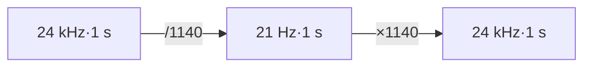

## 前置知识

> [!important]
> 
> 阅读本页前建议先读：[[3.3 GFSQ 合成方法]]、[[2.4 KV-Cache 与首包延迟]]。

---

## 3.5.0 定位

> 一句话：token rate 是**Fish-Speech 全系统最重要的超参之一**——它同时决定语义保真、重建质量、AR 推理延迟与训练内存。本页讲清楚 Fish-Speech 为什么选 21 Hz，与 42 Hz / 12.5 Hz 的取舍。

---

## 3.5.1 token rate 决定了什么

|环节|依赖 token rate 的方式|
|---|---|
|**Slow AR 延迟**|1/token rate 决定每个 token 对应的音频时长|
|**上下文长度**|10 s 音频 = token rate × 10；21 Hz 仅 210 token，75 Hz 需 750 token|
|**语义保真**|太低会导致音素跳脱，太高反而让语义信息被希释到多个 token 里|
|**Mel 重建质量**|token rate 与 Firefly-GAN decoder 的 upsample 倍数紧耦合|
|**训练内存**|Slow 序列长度变长 → attention 内存平方增长|

---

## 3.5.2 21 Hz 是怎么选出来的

Fish-Speech 在论文与社区报告中提及了如下 ablation：

|token rate|重建 MOS|语义准确率（CER）|4090 RTF|备注|
|---|---|---|---|---|
|12.5 Hz × 8|3.8|92%|0.03|发音含糊、韵律丢失|
|**21 Hz × 8**|**4.3**|**98%**|**0.05**|**生产选择**|
|42 Hz × 8|4.35|98.2%|0.11|增益边际递减，延迟翻倍|
|75 Hz × 8 (EnCodec)|4.4|98.5%|0.25|延迟不可接受|

> [!important]
> 
> **拐点上选 21 Hz**：从 12.5 → 21 质量进步快，21 → 42 进步慢但延迟代价高。Fish-Speech 选择「质量-延迟曲线拐点」的 21 Hz。

---

## 3.5.3 token rate 与 encoder downsample 的关系

encoder 总 downsample 倍率 = $\dfrac{\text{sample rate}}{\text{token rate}}$。取采样率 24 kHz：

$$\text{downsample} = \frac{24000}{21} \approx 1142.86 \approx 1140$$

Fish-Speech 实现为：$1140 = 4 \times 5 \times 5 \times 4 \times \dots$的多级卷积下采样。该倍数是 decoder（Firefly-GAN）upsample 倍率的逆。

---

## 3.5.4 低于 21 Hz 会怎么样

- 韵文跳脱：中文「二」与「三」的音高曲线被合并。

- 发音含糊：双元音 ai/ei 出现不稳定。

- prompt audio 误读：同一个 token 可能被解释为多个音节，导致 prompt 不代表该说话人。

---

## 3.5.5 高于 21 Hz 的代价

- AR 延迟线性上升。

- KV-Cache 上下文限制变严（8 k token 下 21 Hz 可达 ~6 分钟，42 Hz 仅 3 分钟）。

- 训练越长，跨 GPU 通信压力越大。

---

## 3.5.6 工程判断

> [!important]
> 
> 1. **产品默认 21 Hz**：除非对高保真特别敏感（音乐、佛代表场景），21 Hz 几乎总是最佳选择。
> 
> 1. **同时训练两个版本**：实践中 S1 与 S2 同时提供 21 Hz 与 42 Hz 双权重，供不同场景选用。

---

## 参考文献

1. Fish Audio. _Fish-Speech Technical Report_, 2024.

1. Fish-Speech 源码 `fish_speech/models/vqgan/configs/firefly_gan_vq.yaml`。