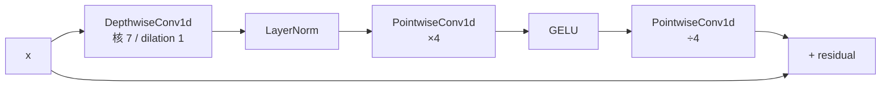

1. Park et al. _EVA-GAN: High-Fidelity Singing Voice Synthesis_. arXiv 2024.

[[4.1.2 HiFi-GAN Decoder]]

1. Fish-Speech 源码 `fish_speech/models/vqgan/modules/firefly.py`。

---

## 参考文献

1. Liu et al. _A ConvNet for the 2020s_. CVPR 2022 (ConvNeXt).

[[4.1.1 ConvNeXt Encoder]]

## 前置知识

> [!important]
> 
> 阅读本页前建议先读：[[4. 声码器：Firefly-GAN（FFGAN）]]。如果不熟悉 HiFi-GAN，可参考该论文。

---

## 4.1.0 定位

> 一句话：EVA-GAN 是 Firefly-GAN 的直接思想源之一——它在 HiFi-GAN 基础上提出用 ConvNeXt + AdaIN 提升多语种 / 多说话人的鲁棒性，并保持 < 30 M 参数。

---

## 4.1.1 EVA-GAN 架构要点

|模块|EVA-GAN|HiFi-GAN|
|---|---|---|
|主干块|**ConvNeXt 1D**|MRF（多受野野融合）|
|上采样|Conv1d transpose × 4|Conv1d transpose × 4|
|语种 / 说话人条件|**AdaIN 注入**|无|
|判别器|MPD + MRD|MPD + MSD|
|参数量|~30 M|~14 M|
|MOS（24 kHz）|4.4|4.2|

---

## 4.1.2 ConvNeXt 1D 为什么适合声码器

ConvNeXt 原为图像设计，其“大核 depthwise + LayerNorm + GELU + pointwise”范式可直接移植到 1D：

在声码器上的优点：

1. **大核 depthwise** 提供长受野野而不增加参数。

1. **LayerNorm** 比 BatchNorm 更适合变长序列。

1. **两次 pointwise** 起到 SE-style channel mixing 作用。

1. **GELU** 避免了 ReLU 在高频区产生镜像频谱的问题。

> [!important]
> 
> **为什么 BigVGAN 选 Snake 而不是 GELU？** Snake 不是「更好」，而是「周期性更强」，适合高保真。Firefly-GAN 在 22 M 参数下选 GELU 以控制计算代价。

---

## 4.1.3 AdaIN 条件注入

EVA-GAN 在每个 ConvNeXt block 后加入 AdaIN（Adaptive Instance Normalization），注入说话人、语种 embedding：

$$\text{AdaIN}(x, s) = \sigma(s) \cdot \frac{x - \mu(x)}{\sigma(x)} + \mu(s)$$

其中 $s$ 是说话人/语种 embedding。

Fish-Speech 实际上**不走 AdaIN 路线**，而是在 GFSQ 里隐含音色，使 decoder 不需要外部 speaker embedding。详见 [[1. 版本谱系与演进路线]]。

---

## 4.1.4 从 EVA-GAN 到 Firefly-GAN 的改动

|项目|EVA-GAN|**Firefly-GAN**|
|---|---|---|
|上采样|Conv1d transpose|**Dilated Conv1d 上采样**|
|主干块数|4|2|
|条件注入|AdaIN|**取消**（GFSQ 已含音色）|
|判别器|MPD + MRD|MPD + MRD + MSD|
|参数量|~30 M|**~22 M**|

详见 [[4.1.1 ConvNeXt Encoder]]、[[4.1.2 HiFi-GAN Decoder]]。

---

## 4.1.5 工程判断

> [!important]
> 
> 1. **EVA-GAN 是代码可读的起点**：社区版 EVA-GAN 代码是读 Firefly-GAN 源码的最快路径。
> 
> 1. **AdaIN 不是必须**：如果 tokenizer 已能编码音色，可完全去掉 AdaIN 以减训练不稳定。

---

## 下沉 L4 子页