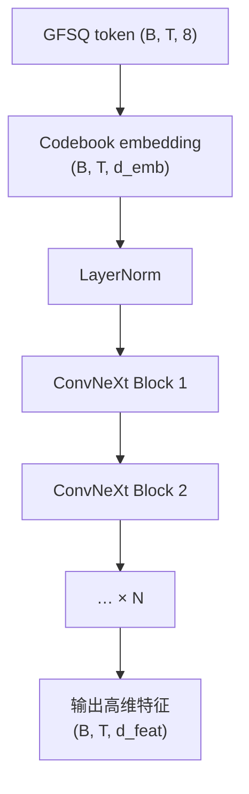
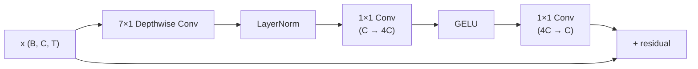

## 前置知识

> [!important]
> 
> 先读：[[4.1 EVA-GAN 架构基础]]、[[4.2 Depthwise 可分离卷积]]。熟悉 ConvNet/ResNet。

---

## 4.1.1.0 定位

> 一句话：ConvNeXt Encoder 是 Firefly-GAN 的「上采样前身」，负责从 **GFSQ token 序列提抽高维特征**，作为 HiFi-GAN Decoder 的输入。

---

## 4.1.1.1 架构总览



---

## 4.1.1.2 ConvNeXt Block 内部结构

Liu et al. (CVPR 2022) 的 ConvNeXt 块：



三个关键设计：

1. **Depthwise 7×1 Conv**：大感野低参。

1. **Inverted Bottleneck**：C → 4C → C。

1. **GELU 代 ReLU + LayerNorm 代 BatchNorm**。

---

## 4.1.1.3 参数量与计算量

|版本|块数|C|参数|FLOPs（1s 25Hz token）|
|---|---|---|---|---|
|V1.5|8|512|~25M|~0.2 GFLOPs|
|S1|12|512|~40M|~0.3 GFLOPs|
|S2-Pro|16|768|~100M|~0.8 GFLOPs|

---

## 4.1.1.4 为什么选 ConvNeXt 不选 Transformer

> [!important]
> 
> 1. **本地依赖**：语音本地质量依赖本地信息（送气、领形、肤纹），ConvNet 适合。
> 
> 1. **推理快**：低 FLOPs，在推理供服上 Vocoder 不能是瓶颈。
> 
> 1. **梯度稳**：Residual + LayerNorm 设计。
> 
> 1. **与 Mel 同构**：传统 vocoder 都以 Mel 为输入，ConvNet 生态成熟。

---

## 4.1.1.5 PyTorch 实现

```python
import torch.nn as nn

class ConvNeXtBlock(nn.Module):
    def __init__(self, dim, mlp_ratio=4):
        super().__init__()
        self.dwconv = nn.Conv1d(dim, dim, 7, padding=3, groups=dim)
        self.norm = nn.LayerNorm(dim)
        self.pwconv1 = nn.Linear(dim, dim * mlp_ratio)
        self.act = nn.GELU()
        self.pwconv2 = nn.Linear(dim * mlp_ratio, dim)

    def forward(self, x):  # x: (B, C, T)
        residual = x
        x = self.dwconv(x)
        x = x.transpose(1, 2)        # (B, T, C)
        x = self.norm(x)
        x = self.pwconv1(x)
        x = self.act(x)
        x = self.pwconv2(x)
        x = x.transpose(1, 2)        # (B, C, T)
        return residual + x
```

---

## 4.1.1.6 与 EVA-GAN 原架构的区别

> [!important]
> 
> EVA-GAN 原始采用 ResNet 风 encoder。Fish-Speech 改为 ConvNeXt 的三点动机：
> 
> 1. 参数效率高 ~20%。
> 
> 1. 训练更稳。
> 
> 1. 与现代 ConvNet trends 对齐。

---

## 4.1.1.7 踩坑记录

> [!important]
> 
> **坑 1：LayerNorm 加在 channel 中间** → 需 transpose，否则 norm 作用于 T 轴。
> 
> **坑 2：depthwise 需 groups=dim** → 忘设 groups 会退化为普通卷积。
> 
> **坑 3：8 个 codebook embedding sum 不是 concat** → sum 节省参数；concat 需 d_emb_total = 8 × d_emb_single。

---

## 参考文献

1. Liu et al. _A ConvNet for the 2020s_. CVPR 2022.

1. Fish Audio. _Firefly-GAN Implementation Notes_, 2024.