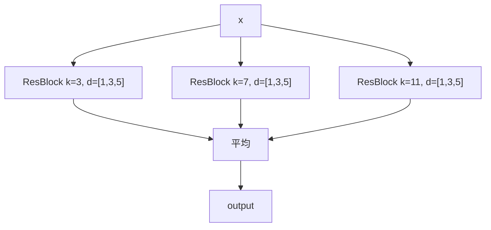

## 前置知识

> [!important]
> 
> 先读：[[4.1 EVA-GAN 架构基础]]、[[4.1.1 ConvNeXt Encoder]]、[[4.3 Dilated 卷积与多尺度感受野]]。

---

## 4.1.2.0 定位

> 一句话：HiFi-GAN Decoder 是 Firefly-GAN 的「上采样处理」部分，负责从 ConvNeXt 输出的高维特征生成 24kHz 波形。

---

## 4.1.2.1 上采样路线

GFSQ token rate = 25 Hz，目标采样率 = 24000 Hz。上采样倍数 = $\frac{24000}{25} = 960\times$。

```mermaid
flowchart LR
	IN["输入 (B, C, 25 Hz)"] --> U1["上采样 4x<br>(B, C/2, 100 Hz)"]
	U1 --> U2["上采样 5x<br>(B, C/4, 500 Hz)"]
	U2 --> U3["上采样 4x<br>(B, C/8, 2000 Hz)"]
	U3 --> U4["上采样 3x<br>(B, C/16, 6000 Hz)"]
	U4 --> U5["上采样 2x<br>(B, C/32, 12000 Hz)"]
	U5 --> U6["上采样 2x<br>(B, C/64, 24000 Hz)"]
	U6 --> O["波形 (B, 1, T)"]
	style IN fill:\#2a2f4a,stroke:\#5b6ea6,color:\#e0e6f7
	style U1 fill:\#3a2f4a,stroke:\#8a6ea6,color:\#e8d8f7
	style U2 fill:\#3a2f4a,stroke:\#8a6ea6,color:\#e8d8f7
	style U3 fill:\#3a2f4a,stroke:\#8a6ea6,color:\#e8d8f7
	style U4 fill:\#3a2f4a,stroke:\#8a6ea6,color:\#e8d8f7
	style U5 fill:\#3a2f4a,stroke:\#8a6ea6,color:\#e8d8f7
	style U6 fill:\#3a2f4a,stroke:\#8a6ea6,color:\#e8d8f7
	style O fill:\#2a4a3f,stroke:\#5ba68a,color:\#d8f7e8
```



总倍数 $4 \times 5 \times 4 \times 3 \times 2 \times 2 = 960$。

---

## 4.1.2.2 上采样块结构

每个上采样块含三件：

1. **Transposed Conv1d**：跨区上采样倍数 $r$，kernel = $2r$，stride = $r$。

1. **MRF（Multi-Receptive Field Fusion）**：多个不同感野的 ResBlock 并行后取平均。

1. **LeakyReLU**：slope = 0.1。

---

## 4.1.2.3 MRF 结构



多感野设计让 Decoder 同时抓取低频（大 kernel）与高频（小 kernel）表达。

---

## 4.1.2.4 参数量与计算量

Fish-Speech 默认配置：

- Initial channels = 512，全路偏减 2×。

- 6 个上采样 stage。

- ~14M 参数。

- 24kHz 波形生成 1s 需 ~0.3 GFLOPs。

---

## 4.1.2.5 PyTorch 实现核心

```python
import torch.nn as nn
import torch.nn.functional as F

class ResBlock(nn.Module):
    def __init__(self, channels, kernel_size=3, dilations=(1, 3, 5)):
        super().__init__()
        self.convs1 = nn.ModuleList([
            nn.Conv1d(channels, channels, kernel_size, padding=d*(kernel_size-1)//2, dilation=d)
            for d in dilations
        ])
        self.convs2 = nn.ModuleList([
            nn.Conv1d(channels, channels, kernel_size, padding=(kernel_size-1)//2)
            for _ in dilations
        ])
    def forward(self, x):
        for c1, c2 in zip(self.convs1, self.convs2):
            xt = F.leaky_relu(x, 0.1)
            xt = c1(xt)
            xt = F.leaky_relu(xt, 0.1)
            xt = c2(xt)
            x = x + xt
        return x

class UpsampleBlock(nn.Module):
    def __init__(self, in_ch, out_ch, upsample_rate):
        super().__init__()
        self.up = nn.ConvTranspose1d(in_ch, out_ch, kernel_size=2*upsample_rate, stride=upsample_rate, padding=upsample_rate//2)
        self.mrf = nn.ModuleList([
            ResBlock(out_ch, k, (1, 3, 5)) for k in (3, 7, 11)
        ])
    def forward(self, x):
        x = F.leaky_relu(x, 0.1)
        x = self.up(x)
        xs = [block(x) for block in self.mrf]
        return sum(xs) / len(xs)
```

---

## 4.1.2.6 与原始 HiFi-GAN 的区别

|项目|HiFi-GAN V1|**Firefly-GAN**|
|---|---|---|
|输入|Mel spectrogram (80, T_mel)|**高维特征 (512, T_token)**|
|上采样倍数|(8, 8, 2, 2) = 256x|**(4, 5, 4, 3, 2, 2) = 960x**|
|kernel sizes|(3, 7, 11)|(3, 7, 11)|
|重发布许可|MIT|CC-BY-NC-SA|

---

## 4.1.2.7 踩坑记录

> [!important]
> 
> **坑 1：ConvTranspose1d padding 计算错** → 输出长度与预期不同。记住 $L_{out} = (L_{in} - 1) \cdot \text{stride} + 2 \cdot \text{padding}$。
> 
> **坑 2：MRF 平均未除数** → amplitude 偏偏于原始 3 倍。
> 
> **坑 3：LeakyReLU slope=0.2 (默认)** → 表现下降，需 0.1。

---

## 参考文献

1. Kong et al. _HiFi-GAN: Generative Adversarial Networks for Efficient and High Fidelity Speech Synthesis_. NeurIPS 2020.

1. Fish Audio. _Firefly-GAN Implementation Notes_, 2024.