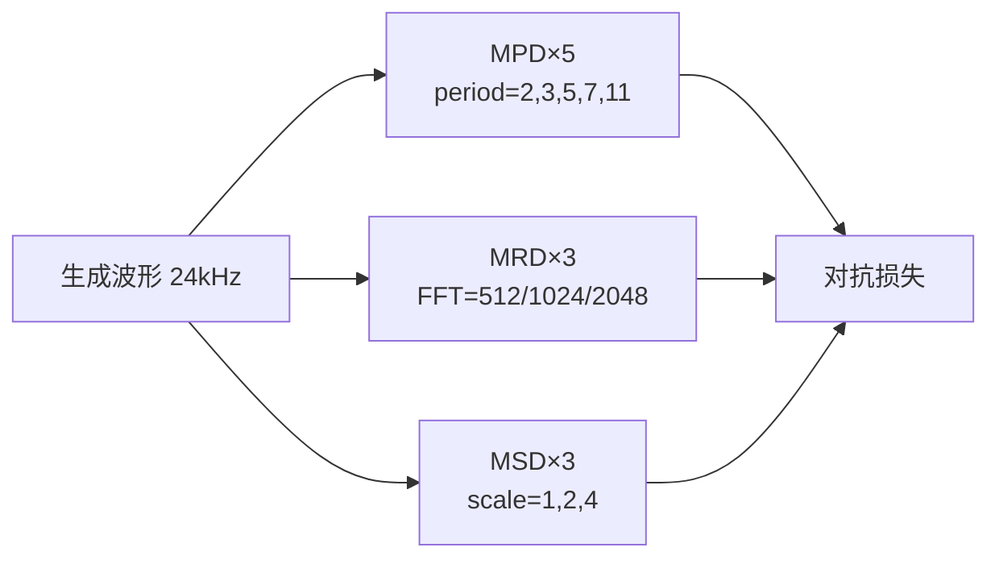

---

## 参考文献

1. Kong et al. _HiFi-GAN: Generative Adversarial Networks for Efficient and High-Fidelity Speech Synthesis_. NeurIPS 2020.

[[4.4.5 Feature Matching Loss]]

1. Jang et al. _UnivNet_. Interspeech 2021.

## 前置知识

> [!important]
> 
> 阅读本页前建议先读：[[4. 声码器：Firefly-GAN（FFGAN）]]。熟悉 GAN 损失、STFT、Mel 谱会有助。

---

## 4.4.0 定位

> 一句话：与生成器相比，判别器与损失函数是 Firefly-GAN 质量的**真正决定者**。Fish-Speech 使用 **MPD + MRD + MSD 三重判别器**，加上 Mel + Feature Matching + Adversarial 三重损失，联合优化。

---

## 4.4.1 三个判别器的分工

|判别器|全名|抳制什么伪影|架构要点|
|---|---|---|---|
|**MPD**|Multi-Period Discriminator|**周期性伪影**（金属声、鑚齿状）|将 1D 波形 reshape 为 2D，水平 stride = period (2,3,5,7,11)|
|**MRD**|Multi-Resolution Discriminator|**高频细节丢失**|不同 FFT 窗口（512/1024/2048）的 STFT 谱面上卷积|
|**MSD**|Multi-Scale Discriminator|**跨尺度不一致**|下采样×2、×4 后的波形上 1D 卷积|

> [!important]
> 
> **三重判别器的互补逻辑**：MPD 看的是「周期际表现」，MRD 看的是「频谱多尺度」，MSD 看的是「波形多尺度」。任一个单独使用都会遗漏某类伪影。

---

## 4.4.2 损失函数总览

Firefly-GAN 损失 = 生成器损失 + 判别器损失。

### 生成器损失

$$\mathcal{L}_G = \lambda_{adv} \mathcal{L}_{adv}^G + \lambda_{fm} \mathcal{L}_{fm} + \lambda_{mel} \mathcal{L}_{mel}$$

- $\mathcal{L}_{adv}^G = \mathbb{E}_x \left[ (D(G(x)) - 1)^2 \right]$（LSGAN）

- $\mathcal{L}_{fm} = \sum_l \| D_l(x) - D_l(G(x)) \|_1$（Feature Matching）

- $\mathcal{L}_{mel} = \| \text{mel}(x) - \text{mel}(G(x)) \|_1$（Mel 重建）

默认权重 $\lambda_{adv}=1, \lambda_{fm}=2, \lambda_{mel}=45$。

### 判别器损失

$$\mathcal{L}_D = \mathbb{E}_x \left[ (D(x) - 1)^2 \right] + \mathbb{E}_z \left[ D(G(z))^2 \right]$$

---

## 4.4.3 为什么 mel loss 权重 45

HiFi-GAN 发现 mel loss 主导起步阶段的训练，避免 GAN 崩溃：

1. 在训练初期（< 50 k step），mel loss 贡献超过 80%。

1. 中后期（> 500 k step），adversarial + fm 接手，mel loss 限住重建谱。

1. 双重作用保证了「高保真 + 不坍塌」。

---

## 4.4.4 各 损失项的作用

> [!important]
> 
> - **mel loss**：保证听觉表现多个重要频段上不失真。
> 
> - **feature matching**：让中间层的特征接近，避免生成器走 「欺骗判别器」的低级路径。
> 
> - **adversarial**：带入人耳不可感知但判别器可感知的高频信息，提升 「人耳 MOS」。

---

## 4.4.5 训练稳定技巧

> [!important]
> 
> 1. **生成器/判别器 1:1 交替**：不需 multi-step。
> 
> 1. **R1 regularization**：判别器梯度惩罚，避免丰错。
> 
> 1. **EMA 生成器权重**：推理时用 EMA 版提升听觉。
> 
> 1. **判别器独立学习率高 2×**：避免生成器跑赢判别器。

---

## 4.4.6 常见误区

> [!important]
> 
> **误区 1**：「mel loss 越大越好」——不是。太大会让生成器逾近线性化，高频丢失。
> 
> **误区 2**：「Feature matching 可以取消」——不能，它是 GAN 训练中少有的「语义对齐」信号。
> 
> **误区 3**：「MSD 不重要」——不能去，他抳制跨尺度伪影。

---

## L4 子页

[[4.4.1 Multi-Period Discriminator（MPD）]]

[[4.4.2 Multi-Scale Discriminator（MSD）]]

[[4.4.3 Adversarial Loss]]

[[4.4.4 Mel Reconstruction Loss]]