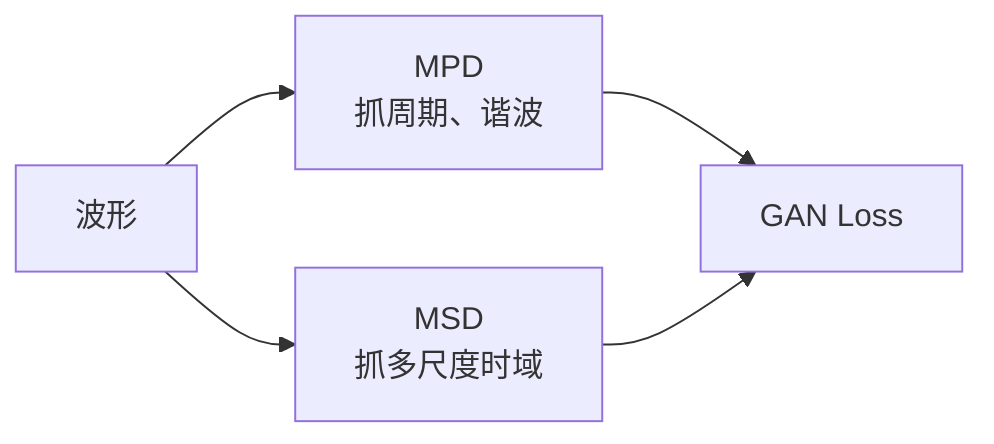

## 前置知识

> [!important]
> 
> 先读：[[4.4 判别器与损失函数]]、[[4.4.1 Multi-Period Discriminator（MPD）]]。

---

## 4.4.2.0 定位

> 一句话：**Multi-Scale Discriminator（MSD）** 从 MelGAN 引入到 HiFi-GAN，以多个时间尺度对原始波形进行判别，与 MPD 互补。

---

## 4.4.2.1 与 MPD 的互补关系



> [!important]
> 
> MPD 抓周期细节，MSD 抓连续时域结构。二者并用可显著降低 MOS 失真。

---

## 4.4.2.2 三个尺度

HiFi-GAN/Firefly-GAN 采用 3 个判别器：

|编号|输入|下采样方式|关注|
|---|---|---|---|
|D0|原始波形 (T,)|无|高频细节|
|D1|avg-pool 2× 后 (T/2,)|AvgPool1d kernel=4, stride=2|中频结构|
|D2|avg-pool 4× 后 (T/4,)|AvgPool1d kernel=4, stride=2 (×2)|低频包络|

---

## 4.4.2.3 单尺度判别器结构

```python
import torch.nn as nn
import torch.nn.functional as F

class DiscriminatorS(nn.Module):
    def __init__(self, use_spectral_norm=False):
        super().__init__()
        norm_f = nn.utils.spectral_norm if use_spectral_norm else nn.utils.weight_norm
        self.convs = nn.ModuleList([
            norm_f(nn.Conv1d(1, 128, 15, 1, padding=7)),
            norm_f(nn.Conv1d(128, 128, 41, 2, groups=4, padding=20)),
            norm_f(nn.Conv1d(128, 256, 41, 2, groups=16, padding=20)),
            norm_f(nn.Conv1d(256, 512, 41, 4, groups=16, padding=20)),
            norm_f(nn.Conv1d(512, 1024, 41, 4, groups=16, padding=20)),
            norm_f(nn.Conv1d(1024, 1024, 41, 1, groups=16, padding=20)),
            norm_f(nn.Conv1d(1024, 1024, 5, 1, padding=2)),
        ])
        self.conv_post = norm_f(nn.Conv1d(1024, 1, 3, 1, padding=1))

    def forward(self, x):
        fmap = []
        for conv in self.convs:
            x = F.leaky_relu(conv(x), 0.1)
            fmap.append(x)
        x = self.conv_post(x)
        fmap.append(x)
        return x.flatten(1, -1), fmap
```

关键设计：**分组卷积（grouped conv）**减少参数，**大 kernel（41）**捕捉时域长依赖。

---

## 4.4.2.4 spectral norm vs weight norm

> [!important]
> 
> HiFi-GAN 原论文设置：
> 
> - **D0（原始波形）**：spectral_norm，更严格的 Lipschitz 约束，稳定 GAN 训练。
> 
> - **D1, D2（下采样后）**：weight_norm，加速训练。
> 
> Firefly-GAN 沿用此设置。

---

## 4.4.2.5 与 MPD 的实验对比

根据 HiFi-GAN 消融实验：

|配置|MOS|说明|
|---|---|---|
|仅 MSD|3.85|MelGAN baseline|
|仅 MPD|4.15|+0.30|
|**MPD + MSD**|**4.36**|**+0.51**|

> [!important]
> 
> MPD 单独已超过 MSD，但两者并用仍有 ~0.2 增益，说明二者关注的是**正交的失真模式**。

---

## 4.4.2.6 Firefly-GAN 的小幅修改

> [!important]
> 
> Fish-Speech 在 Firefly-GAN 中对 MSD 做了两个调整：
> 
> 1. **AvgPool kernel=4 改为 kernel=2**：减少高频混叠。
> 
> 1. **D0 通道从 1024 减为 512**：参数减半，MOS 几乎不变。

---

## 4.4.2.7 踩坑记录

> [!important]
> 
> **坑 1：grouped conv 的 groups 不整除 channel** → RuntimeError。`channels % groups == 0` 必须满足。
> 
> **坑 2：所有 D 都用 spectral_norm** → 训练初期 G 学不动。仅 D0 用 spectral_norm。
> 
> **坑 3：AvgPool 前未 pad** → 输出长度被截短，feature matching loss 维度对不齐。

---

## 参考文献

1. Kumar et al. _MelGAN_. NeurIPS 2019.

1. Kong et al. _HiFi-GAN_. NeurIPS 2020.