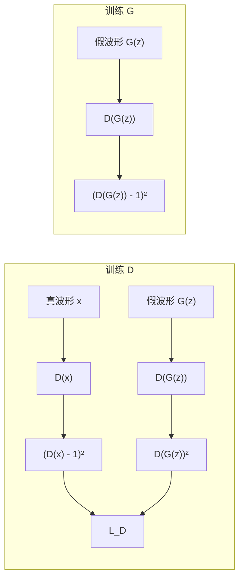

## 前置知识

> [!important]
> 
> 先读：[[4.4 判别器与损失函数]]、[[4.4.1 Multi-Period Discriminator（MPD）]]、[[4.4.2 Multi-Scale Discriminator（MSD）]]。熟悉 GAN 训练。

---

## 4.4.3.0 定位

> 一句话：**Adversarial Loss** 是 GAN 训练的核心，让生成器 G 学习「骗过」判别器 D，进而合成出更接近真实的波形。Fish-Speech 采用 **LSGAN（Least-Squares GAN）** 形式。

---

## 4.4.3.1 标准 GAN vs LSGAN

标准 GAN（Goodfellow 2014）：

$$\min_G \max_D \mathbb{E}_{x \sim p_{\text{data}}}[\log D(x)] + \mathbb{E}_{z}[\log(1 - D(G(z)))]$$

问题：sigmoid 输出 + BCE loss 导致**梯度消失**（D 太强时 G 学不动）。

LSGAN（Mao et al. 2017）：

$$\min_D \frac{1}{2}\mathbb{E}_{x \sim p_{\text{data}}}[(D(x) - 1)^2] + \frac{1}{2}\mathbb{E}_{z}[D(G(z))^2]$$

$$\min_G \frac{1}{2}\mathbb{E}_{z}[(D(G(z)) - 1)^2]$$

**优势**：D 输出无 sigmoid，loss 与距离成正比，梯度不消失。

---

## 4.4.3.2 损失图示



---

## 4.4.3.3 多判别器聚合

Firefly-GAN 有 5 个 MPD + 3 个 MSD = 8 个判别器。Adversarial loss 在所有判别器上求平均：

$$\mathcal{L}_{\text{adv}}^G = \frac{1}{N} \sum_{k=1}^{N} \mathbb{E}_{z}[(D_k(G(z)) - 1)^2]$$

$$\mathcal{L}_{\text{adv}}^D = \frac{1}{N} \sum_{k=1}^{N} \Big( \mathbb{E}_{x}[(D_k(x) - 1)^2] + \mathbb{E}_{z}[D_k(G(z))^2] \Big)$$

其中 $N = 8$。

---

## 4.4.3.4 PyTorch 实现

```python
import torch

def discriminator_loss(disc_real_outputs, disc_fake_outputs):
    """L_D = mean[(D(x) - 1)² + D(G(z))²]"""
    loss = 0
    for dr, df in zip(disc_real_outputs, disc_fake_outputs):
        r_loss = ((dr - 1) ** 2).mean()
        f_loss = (df ** 2).mean()
        loss += r_loss + f_loss
    return loss / len(disc_real_outputs)

def generator_loss(disc_fake_outputs):
    """L_G = mean[(D(G(z)) - 1)²]"""
    loss = 0
    for df in disc_fake_outputs:
        loss += ((df - 1) ** 2).mean()
    return loss / len(disc_fake_outputs)
```

---

## 4.4.3.5 G 总损失组合

Firefly-GAN 的 G 总损失是 4 项加权和：

$$\mathcal{L}_G = \mathcal{L}_{\text{adv}}^G + \lambda_{\text{fm}} \mathcal{L}_{\text{fm}} + \lambda_{\text{mel}} \mathcal{L}_{\text{mel}}$$

> [!important]
> 
> **权重经验值**：
> 
> - $\lambda_{\text{adv}} = 1$
> 
> - $\lambda_{\text{fm}} = 2$（feature matching loss）
> 
> - $\lambda_{\text{mel}} = 45$（Mel reconstruction loss）
> 
> Mel loss 权重最高，因为它是**重建质量的主要约束**；adversarial loss 仅作为「自然度」调节。

---

## 4.4.3.6 训练动力学

> [!important]
> 
> **G 与 D 的更新频率**：
> 
> - HiFi-GAN：1:1（每 step 都更新两者）。
> 
> - Firefly-GAN：1:1，但 D 学习率减半（防止 D 过强）。
> 
> **常见失败模式**：
> 
> 1. **D loss → 0**：D 太强，G 梯度消失。解药：降低 D lr，或加噪声到 D 输入。
> 
> 1. **G loss 震荡**：两者势均力敌但未收敛。解药：增大 Mel loss 权重，让重建主导。

---

## 4.4.3.7 踩坑记录

> [!important]
> 
> **坑 1：D 输出加了 sigmoid** → 实际上变成了标准 GAN，梯度消失。LSGAN 必须**无 sigmoid**。
> 
> **坑 2：G 训练时未 detach 真波形** → 真波形不参与 G 的反向传播，但写错会导致计算图泄漏。
> 
> **坑 3：adversarial loss 不收敛** → 检查 D 的 spectral_norm 是否应用，以及 lr。

---

## 参考文献

1. Goodfellow et al. _Generative Adversarial Nets_. NeurIPS 2014.

1. Mao et al. _Least Squares Generative Adversarial Networks_. ICCV 2017.

1. Kong et al. _HiFi-GAN_. NeurIPS 2020.