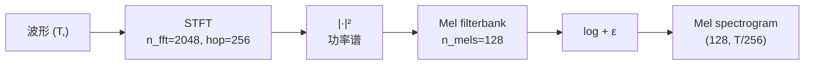

## 前置知识

> [!important]
> 
> 先读：[[4.4 判别器与损失函数]]。熟悉 Mel spectrogram、STFT。

---

## 4.4.4.0 定位

> 一句话：**Mel Reconstruction Loss** 在 Mel 频谱域计算合成波形与真实波形的 L1 距离，提供**最直接的频谱级监督**，是 G 总损失中权重最大的一项。

---

## 4.4.4.1 公式

$$\mathcal{L}_{\text{mel}} = \mathbb{E}_{(x, z)} \big[ \| \phi(x) - \phi(G(z)) \|_1 \big]$$

其中 $\phi(\cdot)$ 是 **Mel 频谱提取**：

$$\phi(x) = \log\!\left( \text{MelFilter} \cdot |\text{STFT}(x)|^2 + \epsilon \right)$$

---

## 4.4.4.2 Mel 提取流程



---

## 4.4.4.3 Firefly-GAN 配置

|参数|值|说明|
|---|---|---|
|采样率|24000 Hz|输出波形采样率|
|n_fft|2048|STFT 窗大小|
|hop_length|256|~10.7ms 跳幅|
|win_length|2048|等于 n_fft|
|n_mels|128|Mel 通道数|
|f_min|0|低频截止|
|f_max|12000|奈奎斯特频率|
|权重 $\lambda_{\text{mel}}$|**45**|HiFi-GAN 同款|

---

## 4.4.4.4 为什么 L1 而非 L2

> [!important]
> 
> HiFi-GAN/Firefly-GAN 选 L1 的原因：
> 
> 1. **L1 对异常值更鲁棒**：Mel 中偶发的尖峰不会被过度惩罚。
> 
> 1. **L1 产生更稀疏的误差**：保留高频细节而非整体模糊。
> 
> 1. **MelGAN/Parallel WaveGAN 实验都证实 L1 > L2**：MOS 平均提升 0.1-0.2。
> 
> L2 倾向于产生「过平滑」的合成波形。

---

## 4.4.4.5 PyTorch 实现

```python
import torch
import torchaudio

class MelLoss(torch.nn.Module):
    def __init__(self, sample_rate=24000, n_fft=2048, hop=256, n_mels=128, f_max=12000):
        super().__init__()
        self.mel = torchaudio.transforms.MelSpectrogram(
            sample_rate=sample_rate,
            n_fft=n_fft,
            hop_length=hop,
            n_mels=n_mels,
            f_min=0,
            f_max=f_max,
            power=2.0,
        )

    def forward(self, y_pred, y_true):
        # y: (B, 1, T)
        m_pred = torch.log(self.mel(y_pred.squeeze(1)) + 1e-5)
        m_true = torch.log(self.mel(y_true.squeeze(1)) + 1e-5)
        return torch.nn.functional.l1_loss(m_pred, m_true)
```

---

## 4.4.4.6 与 Multi-Resolution STFT Loss 的关系

> [!important]
> 
> Parallel WaveGAN 提出 **Multi-Resolution STFT Loss**：在多个 (n_fft, hop) 配置下计算 L1。
> 
> Firefly-GAN **未采用多分辨率**，仅用单一 Mel loss，原因：
> 
> 1. MPD 已经提供了多周期判别，频域信息已被多尺度覆盖。
> 
> 1. 多分辨率 STFT 增加 ~20% 训练时间，收益边际。

---

## 4.4.4.7 训练监控

> [!important]
> 
> **收敛信号**：
> 
> - $\mathcal{L}_{\text{mel}}$ 在 50k step 内从 ~1.5 降到 ~0.3。
> 
> - 200k step 后稳定在 0.15-0.25。
> 
> - 若 1M step 仍 > 0.5，说明 G 容量不足或 lr 过小。
> 
> **与 MOS 的关系**：经验上 $\mathcal{L}_{\text{mel}} < 0.2$ 对应 MOS ≥ 4.2。

---

## 4.4.4.8 踩坑记录

> [!important]
> 
> **坑 1：log 内未加 ε** → 静音段 log(0) = -inf，loss NaN。$\epsilon = 10^{-5}$ 通常安全。
> 
> **坑 2：Mel 提取的 device 与梯度** → torchaudio MelSpectrogram 默认 buffer 不在 CUDA。需 `.to(device)`。
> 
> **坑 3：fp16 下 Mel 计算溢出** → STFT 大数值在 fp16 会 inf。建议 Mel 计算 cast 到 fp32。
> 
> **坑 4：权重 45 在不同 batch_size 下需重新调** → batch_size 翻倍时可调至 30-35。

---

## 参考文献

1. Kong et al. _HiFi-GAN_. NeurIPS 2020.

1. Yamamoto et al. _Parallel WaveGAN_. ICASSP 2020.