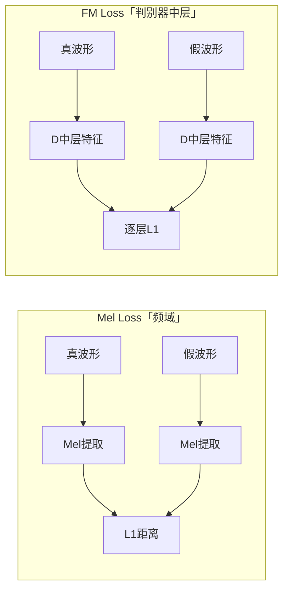

## 前置知识

> [!important]
> 
> 先读：[[4.4 判别器与损失函数]]、[[4.4.3 Adversarial Loss]]、[[4.4.4 Mel Reconstruction Loss]]。熟悉感知损失、VGG 损失。

---

## 4.4.5.0 定位

> 一句话：**Feature Matching Loss（FM Loss）** 在判别器中间特征上计算 L1，让 G 生成的波形不仅骗过 D 的最后输出，还骗过 D 的中层表示。

---

## 4.4.5.1 公式

设判别器 $D_k$ 有 $L_k$ 层，记 $D_k^{(i)}$ 为第 $i$ 层的中间特征，层元素个数 $N_i$。则：

$$\mathcal{L}_{\text{fm}} = \frac{1}{K} \sum_{k=1}^{K} \frac{1}{L_k} \sum_{i=1}^{L_k} \frac{1}{N_i} \big\| D_k^{(i)}(x) - D_k^{(i)}(G(z)) \big\|_1$$

其中 $K = 8$（5 MPD + 3 MSD）。

---

## 4.4.5.2 与 Mel Loss 的区别



> [!important]
> 
> Mel Loss 使用**固定的频谱变换**，FM Loss 使用**动态学习的判别器特征**。二者互补：Mel 保证低频保真，FM 保证高频自然度。

---

## 4.4.5.3 为什么 FM Loss 有效

> [!important]
> 
> 1. **判别器中层 = 感知特征提取器**：类似 VGG 感知损失，但 D 可随 G 动态适应。
> 
> 1. **稳定化 GAN 训练**：FM 提供了一个「梯度顺滑」的补助 loss，避免 G 仅依赖不稳定的 adversarial signal。
> 
> 1. **加速收敛**：FM 训练阶段 step 50k 内提供主要梯度。
> 
> MelGAN 原论文报告：去掉 FM Loss，MOS 从 4.27 下降到 3.10。

---

## 4.4.5.4 PyTorch 实现

```python
import torch

def feature_matching_loss(fmap_real, fmap_fake):
    """多判别器、多层 L1。
    fmap_real, fmap_fake: list[list[Tensor]]
        outer: 判别器索引；inner: 该判别器的层索引。
    """
    loss = 0
    for dr_layers, df_layers in zip(fmap_real, fmap_fake):
        for r, f in zip(dr_layers, df_layers):
            loss = loss + torch.mean(torch.abs(r.detach() - f))
    return loss
```

注意：**真波形特征 detach**，防止梯度泄露到真样本分支。

---

## 4.4.5.5 权重与调参

|项目|HiFi-GAN|Firefly-GAN|
|---|---|---|
|$\lambda_{\text{fm}}$|2|2|
|中层选取|所有 LeakyReLU 后|同 HiFi-GAN|
|是否含最后一层|含|含|

> [!important]
> 
> **调优经验**：
> 
> - $\lambda_{\text{fm}}$ 太小（< 1）：GAN 训练不稳，G 难收敛。
> 
> - $\lambda_{\text{fm}}$ 太大（> 5）：Mel 重建被押制，高频变模糊。
> 
> - 2 是 HiFi-GAN 与 Firefly-GAN 的稳健设置。

---

## 4.4.5.6 与 VGG 感知损失的对比

|项目|VGG 感知损失|**FM Loss**|
|---|---|---|
|特征提取器|预训练 VGG（固定）|**判别器 D（随 G 联合训练）**|
|适用领域|图像|**音频**|
|动态性|静态|动态适应 G 的失真模式|
|计算量|额外 VGG forward|**复用 D 的 forward**|

---

## 4.4.5.7 踩坑记录

> [!important]
> 
> **坑 1：真样本特征未 detach** → 梯度泄露到 D 对真样本的分支，训练动力学紊乱。
> 
> **坑 2：平均方式不一致** → 不同层平均、不同判别器平均、batch 平均有多种实现。建议透明采用代码中的「逐层 mean 后相加」路径。
> 
> **坑 3：invalid layer indexing** → fmap_real 与 fmap_fake 需同长同结构，否则 zip 静默截断。
> 
> **坑 4：fp16 下不同层 norm 差异大** → 某些层 abs() 会溢出，需 fp32 计算后再 sum。

---

## 参考文献

1. Kumar et al. _MelGAN_. NeurIPS 2019.

1. Kong et al. _HiFi-GAN_. NeurIPS 2020.

1. Wang et al. _High-Resolution Image Synthesis with Latent Diffusion_. CVPR 2022（VGG perceptual loss 参考）.