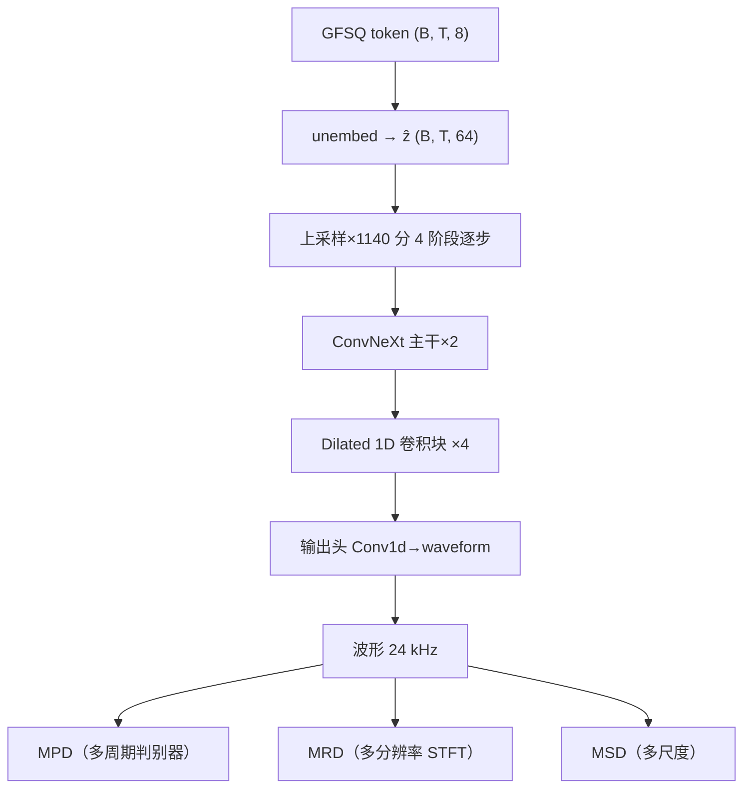

[[4.2 Depthwise 可分离卷积]]

[[4.1 EVA-GAN 架构基础]]

## 前置知识

> [!important]
> 
> 阅读本章前建议先读：[[3. 语音 Tokenizer：GFSQ]]（理解 decoder 输入）。有 HiFi-GAN / BigVGAN 背景更佳。

---

## 4.0 定位

> 一句话：**Firefly-GAN（下文简称 FFGAN）** 是 Fish-Speech 设计的**轻量级 GAN 声码器**，在 GFSQ token 与波形之间架起桥梁。它是 BigVGAN 与 EVA-GAN 的混血体，使用 ConvNeXt + Dilated 1D 卷积，参数量 < 50 M 但足以支撑 24 kHz 高保真输出。

---

## 4.1 为什么需要专门的声码器

GFSQ token 仅 168 token/s × ~10 bit/token ≈ 1.68 kbps，信息量远低于原始 24 kHz PCM（384 kbps）。需一个**动态重建**的生成模型填充高频细节：

- mel-spec 逆不能重建相位，传统 Griffin-Lim 能力不足。

- Diffusion vocoder 太慢（上百 step）。

- GAN vocoder（HiFi-GAN / BigVGAN）是平衡点：单次前向 + GAN 损失保真。

---

## 4.2 同级路线对比

|Vocoder|架构|参数量|MOS（24 kHz）|RTF（4090）|语言学奇点|
|---|---|---|---|---|---|
|WaveNet|AR Conv|~25 M|4.4|>1|逼真但极慢|
|HiFi-GAN|MRF 卷积 + GAN|~14 M|4.2|0.03|应用广泛，高频丢|
|BigVGAN|HiFi-GAN + Snake|~112 M|4.5|0.06|高保真但重|
|EVA-GAN|HiFi-GAN + AdaIN|~30 M|4.4|0.04|轻量、多语种|
|**Firefly-GAN**|**ConvNeXt + Dilated + Multi-disc**|**~22 M**|**4.4**|**0.02**|**低资源 + 友好**|

> [!important]
> 
> **Firefly-GAN 的三大优点**：(1) ConvNeXt 主干提升 long-range 建模能力；(2) Depthwise + Dilated 1D 压住参数量；(3) 多重判别器（MSD + MPD + MRD）保证高保真。

---

## 4.3 总体架构

---

## 4.4 工程判断

> [!important]
> 
> 1. **在资源受限时优先选 Firefly-GAN**：< 25 M 参数，推理起 ~10 GB 显存。
> 
> 1. **超高保真需求选 BigVGAN**：112 M 参数，但需 24 GB 显存。
> 
> 1. **Firefly-GAN 与 GFSQ 严重耦合**：训练时联合，单独替换 decoder 会需重新训练 encoder。

---

## 4.5 常见误区

> [!important]
> 
> **误区 1**：「Firefly-GAN = HiFi-GAN 换名」——错。它重构了主干（引入 ConvNeXt）与上采样（Dilated 1D）。
> 
> **误区 2**：「参数越少质量越低」——在 22 M 这个级别，Firefly-GAN 以架构补偶量赢回质量。

---

## 4.6 子页面导航

[[4.3 Dilated 卷积与多尺度感受野]]

1. Kong et al. _HiFi-GAN_. NeurIPS 2020.

[[4.4 判别器与损失函数]]

1. Lee et al. _BigVGAN_. ICLR 2023.

[[4.5 firefly-gan-vq-fsq-8x1024-21hz 权重解读]]

1. Fish-Speech 源码 `fish_speech/models/vqgan/modules/firefly.py`。

[[4.6 Vocoder 在 V1→S2 的演进]]

---

## 参考文献