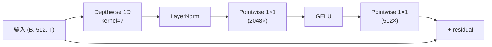

## 前置知识

> [!important]
> 
> 了解标准 Conv1d 的 FLOPs/参数量计算。与 [[4.1 EVA-GAN 架构基础]] 中的 ConvNeXt 结构紧密相关。

---

## 4.2.0 定位

> 一句话：Depthwise Separable Conv（深度可分离卷积）是 Firefly-GAN 能把参数量压到 22 M 的**唯一最重要技术**。本页说清楚他在计算量、参数量、表达力上的取舍。

---

## 4.2.1 公式与参数量对比

设输入 channel = $C_{in}$，输出 channel = $C_{out}$，核大小 = $K$，序列长 $T$。

|类型|参数量|FLOPs / step|
|---|---|---|
|**标准 Conv1d**|$C_{in} \cdot C_{out} \cdot K$|$C_{in} \cdot C_{out} \cdot K \cdot T$|
|**Depthwise + Pointwise**|$C_{in} \cdot K + C_{in} \cdot C_{out}$|$C_{in} \cdot K \cdot T + C_{in} \cdot C_{out} \cdot T$|
|压缩比|$\dfrac{1}{C_{out}} + \dfrac{1}{K}$|同上|

例：$C_{in}=C_{out}=512, K=7$：

- 标准：$512 \times 512 \times 7 = 1.83$ M 参数

- Depthwise+Pointwise：$512 \times 7 + 512 \times 512 = 0.27$ M，**压缩 6.8×**。

---

## 4.2.2 为什么在声码器上依然有效

一个常见担忧：Depthwise 的表达力不足。但在声码器上：

1. **上下文以时间轴为主**：Depthwise 拼接 LayerNorm + Pointwise 足以处理 1D 信号。

1. **多层叠加**：8 层 ConvNeXt block 后，有效感受野 ~$8 \times 7 = 56$ 个 token，足以覆盖一个音节。

1. **与判别器补偏**：生成器后接多重判别器，可以保证高频保真。

---

## 4.2.3 在 Dilated 上使用的限制

Depthwise + Dilated 能进一步扩大感受野，但需注意：

1. **Dilation 越大堆叠越快**：采用指数匆加 1, 3, 9, 27 可能走不过梯度。Firefly-GAN 限制在 dilation $\le 9$。

1. **重叠减少**：Depthwise 没有跨 channel 信息，高 dilation 下会出现 “checkerboard” 伪影。Pointwise 补上。

---

## 4.2.4 工程判断与踩坑

> [!important]
> 
> 1. **kernel 选 7**：3 太小，感受野不足；15 太大，Depthwise 优势堆叠减弱。
> 
> 1. **Pointwise 倍数 4×**：太小会让 channel 混合不足，太大会重新贵。Fish-Speech 选 4× 平衡。
> 
> 1. **bf16 训练 + fp32 LayerNorm**：Depthwise 输出付值范围大，需钉住 fp32 LN。

---

## 常见误区

> [!important]
> 
> **误区 1**：「Depthwise = MobileNet 专属」——错。该技术在语音、视频中广泛使用。
> 
> **误区 2**：「Pointwise 后不需激活」——需要，否则退化为线性。Firefly-GAN 选 GELU。

---

## 参考文献

1. Howard et al. _MobileNets: Efficient Convolutional Neural Networks_. arXiv:1704.04861, 2017.

1. Liu et al. _A ConvNet for the 2020s_. CVPR 2022.

1. Fish-Speech 源码 `fish_speech/models/vqgan/modules/firefly.py`。